# Agent是什么?

大语言模型（比如ChatGPT）虽然能理解输入、分析推理、输出文字或代码，但它更像一个“聪明的对话者”——没有真正的记忆，不会主动规划，也无法动手操作现实世界的东西（比如订机票、查天气）。

而AI Agent（智能代理）就像给语言模型装上了“大脑+手脚”：

1. 会规划​：拆解复杂任务（比如“策划一次旅行” → 自动分成查天气、订酒店、排行程等步骤）

2. 能动手​：调用工具（搜索/计算/订票API/控制智能家居）

3. 有记忆​：长期记住你的习惯（比如你讨厌红眼航班）

4. 更主动​：遇到问题会自己调整方案（比如发现酒店超预算，自动找平替）

> 举个栗子🌰​​：
>
> 你对Agent说："周末想带娃去上海玩，预算5000元"
>
> 它会自动：查天气 → 推荐亲子景点 → 比价订酒店 → 生成带地图的攻略 → 发现超预算时主动调整方案
>
> 本质上就是把大模型升级成能自主干活的智能体。

Agents流程图

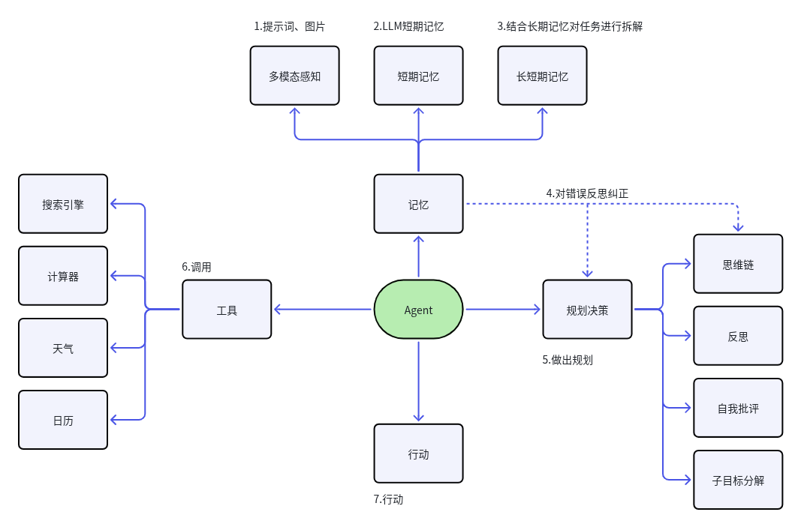

1. 规划能力

智能体能够将复杂任务拆解为可执行的子任务，并动态规划执行路径。通过实时评估任务进展，自主决策继续执行或终止任务。

* 记忆系统

采用双重记忆架构：短期记忆维护任务执行上下文，随子任务动态更新并在任务完成后清除；长期记忆通过向量数据库实现知识持久化存储与检索。

* 工具调用

配备多模态工具API（包括计算引擎、搜索引擎、代码解释器、数据库接口等），使智能体具备物理世界交互能力，解决现实场景问题。

* 执行机制

基于规划决策和记忆系统驱动具体行动，通过工具调用或环境交互实现任务目标。

## 规划（Planning）

当人类面对任务时，会自然进入以下思维流程：

> 1. 任务解析：首先思考任务的本质和完成路径。
>
> 2. 工具评估：审视现有资源，规划工具的高效使用方法。
>
> 3. 任务拆解：将复杂任务结构化分解为可执行的子任务（类似思维导图的分层逻辑）。
>
> 4. 过程反思：执行中持续优化策略，通过经验迭代改进后续步骤。
>
> 5. 终止判断：动态评估任务完成度，决策何时结束执行。

为了让智能体具备类人的任务处理思维，我们通过LLM提示工程构建以下核心能力：

### **分解任务**

* 使LLM能够将复杂任务拆解为可独立执行的子任务模块

* 通过分层递归分解实现任务粒度控制（如：旅行规划→交通预订+酒店选择+行程安排）

#### **思维链（Chain of Thoughts, CoT）**

* 基础推理框架：要求LLM「逐步思考（think step by step）」

* 实现线性推理过程（如：数学解题时显式展示演算步骤）

* 典型应用：需顺序执行的确定性任务

#### **思维树（Tree-of-thought, ToT）**

* 进阶推理框架：在CoT每个节点扩展多分支可能性

* 关键技术：

  * 启发式评估：对分支进行可行性打分

  * 搜索算法：采用BFS/DFS进行空间探索

  * 回溯机制：动态修剪低效路径

* 典型应用：创意生成/多方案决策场景

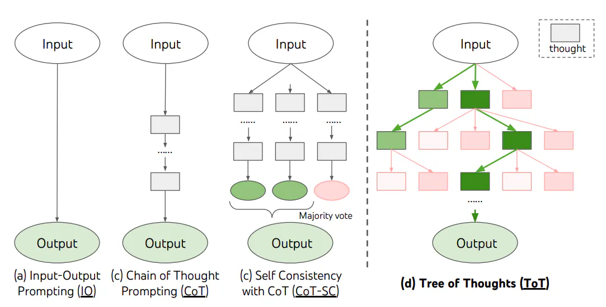

### 反思与改进

Agent 也在不断“回头看”。它明白，行动中犯错是常态，但关键在于如何处理这些错误。当遇到足够“刺头”的问题，或者连续碰壁时，它会停下来，像我们整理房间一样，把之前的思路和做法好好清理一遍。看看哪里没考虑周全，哪里用力过猛，哪里本可以换个方法。这就像我们常说的“亡羊补牢”，虽然损失已经造成，但找到漏洞并修补，下次就安全多了。Agent 通过这种周期性的“复盘”和“补牢”，不断优化自己的“工具箱”，让未来的行动更少波折，结果更接近理想。

#### ReAct框架

目前 LangChain 1.0 的核心设计：

1. 初始化： 模型接收初始任务或问题。

2. 思考： 模型生成一个思考步骤，规划如何开始解决任务。

3. 行动： 模型根据思考结果执行一个行动（如查询信息、计算等）。

4. 观察： 模型接收行动的结果。

5. 迭代： 模型将观察到的结果纳入新的思考中，再次进行思考、行动、观察，直到任务完成或达到某个终止条件。

任务： “告诉我2023年世界杯足球赛的冠军是哪个国家？”

模型（ReAct 框架下）：

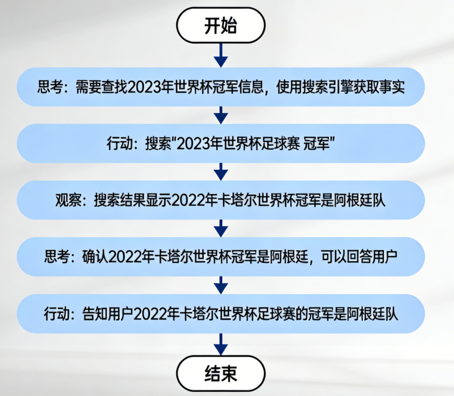

（注：这里简化了“观察”和“行动”的格式，实际实现中可能有更结构化的表示，如 `Thought: ... \n Action: Search[关键词] \n Observation: 搜索结果... \n Thought: ... \n Action: Finish[最终答案]`）

## <span style="color: inherit; background-color: rgb(247,105,100)">记忆（Memory）</span>

**日常中的记忆机制：**

1. 感觉记忆：感官信息的短暂残留，仅持续几秒。

2. 短期记忆：临时存储和处理少量信息，如记电话号码。

3. 长期记忆：持久存储大量信息，分两类：

   1. 显性记忆：可主动回忆的，如个人经历（情景记忆）和知识概念（语义记忆）。

   2. 隐性记忆：无意识的技能和习惯，如骑自行车。

**智能体中的记忆机制：**

1. 形成记忆：通过预训练学习世界知识，内化为长期记忆基础。

2. 短期记忆：任务执行中暂存信息，任务结束后清空。

3. 长期记忆：依赖外部知识库（如向量数据库）存储和检索大量信息。

## <span style="color: inherit; background-color: rgb(247,105,100)">工具使用（Tools/Toolkits）</span>

Agent 能像人类一样，通过学习使用外部工具来突破自身限制。对于模型权重固定、难以更新的LLM来说，调用外部API获取实时信息、执行代码或访问专属数据源，就如同我们借助工具延伸了手脚和大脑。这种能力让LLM不再局限于训练时的知识，显著拓宽了其解决问题的边界。

简单使用工具

```python
pip install langchain-tavily
```

```python
from langchain_openai import ChatOpenAI
from langchain.agents import create_agent
from langchain_tavily import TavilySearch  # 推荐使用标准的社区版导入
from dotenv import load_dotenv
import os

# 加载环境变量
load_dotenv()

# 1. 配置 LLM (通义千问)
model = "qwen3.5-flash-2026-02-23"
api_key = os.getenv("DASHSCOPE_API_KEY")
api_base_url = os.getenv("DASHSCOPE_BASE_URL")

llm = ChatOpenAI(
    model=model,
    api_key=api_key,
    base_url=api_base_url,
    temperature=0.1
)
# 2. 配置工具
# TavilySearchResults 是 LangChain 社区标准的搜索工具封装
tools = [TavilySearch(max_results=1)]

# 3. 创建 Agent
agent = create_agent(
    model=llm,
    tools=tools,
    system_prompt="你是一个超级智能助手，能帮助用户解决问题"
)

# 4. 执行任务
query = "请问现任的美国总统是谁？他的年龄的平方是多少? 请用中文告诉我这两个问题的答案"
try:
    result = agent.invoke({"messages": [{"role": "user", "content": query}]})
    print("\n====== 最终结果 ======")
    print(result["messages"][-1].content)
except Exception as e:
    print(f"发生错误: {e}")
```

### 使用已有的工具

参考：https://docs.langchain.com/oss/python/integrations/tools

## 给Agent添加记忆

```python
from langchain_openai import ChatOpenAI
from langchain.agents import create_agent
from langchain_tavily import TavilySearch  # 推荐使用标准的社区版导入
from langgraph.checkpoint.memory import InMemorySaver
from dotenv import load_dotenv
import os

# 加载环境变量
load_dotenv()

# 1. 配置 LLM (通义千问)
model = "qwen3.5-flash-2026-02-23"
api_key = os.getenv("DASHSCOPE_API_KEY")
api_base_url = os.getenv("DASHSCOPE_BASE_URL")

llm = ChatOpenAI(
    model=model,
    api_key=api_key,
    base_url=api_base_url,
    temperature=0.1
)
# 2. 配置工具
# TavilySearchResults 是 LangChain 社区标准的搜索工具封装
tools = [TavilySearch(max_results=1)]

# 3. 创建 Agent
agent = create_agent(
    model=llm,
    tools=tools,
    system_prompt="你是一个超级智能助手，能帮助用户解决问题",
    checkpointer=InMemorySaver(),
)

# 4. 执行任务
config = {"configurable": {"thread_id": "1"}}
query1 = "请问现任的美国总统是谁？他的年龄的平方是多少? 请用中文告诉我这两个问题的答案"
query2 = "请问我上一个问题问了什么？"
try:
    result = agent.invoke({"messages": [{"role": "user", "content": query1}]}, config)
    print("\n====== 第一次回答 ======")
    print(result["messages"][-1].content)
    result = agent.invoke({"messages": [{"role": "user", "content": query2}]}, config)
    print("\n====== 第二次回答 ======")
    print(result["messages"][-1].content)
except Exception as e:
    print(f"发生错误: {e}")
```

## <span style="color: inherit; background-color: rgb(247,105,100)">中间件系统</span>

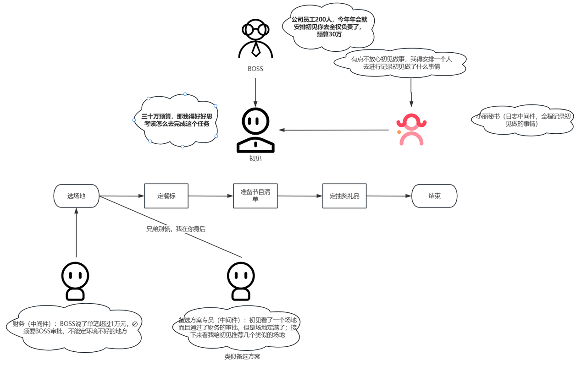

所以**中间件**提供了一种更严格地控制代理内部运行机制的方法

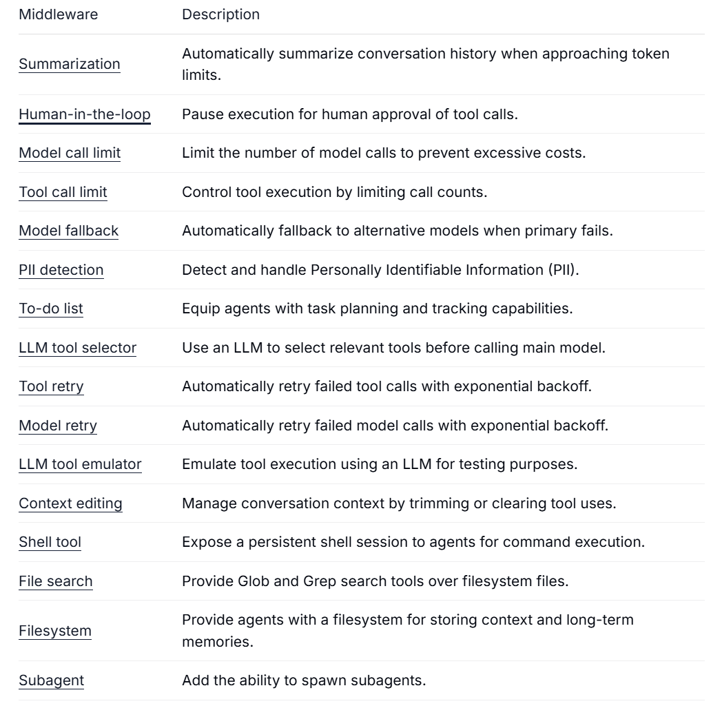

### 摘要总结中间件

**当用户和智能体对话长度接近上下文上限时，系统会自动压缩上下文：**

* **保留最近的消息**，确保最新信息不丢失；

* **早期的历史消息自动浓缩为摘要**，减少占用空间。

目的：

* 解决长对话超出上下文窗口的问题；

* 保证多轮对话仍能保持完整的上下文。

```python
from langchain_openai import ChatOpenAI
from langchain.agents import create_agent
from langchain.agents.middleware import SummarizationMiddleware
from langchain_tavily import TavilySearch
from langgraph.checkpoint.memory import InMemorySaver
from dotenv import load_dotenv
import os

# 加载环境变量
load_dotenv()

model = "qwen3.5-flash-2026-02-23"
api_key = os.getenv("DASHSCOPE_API_KEY")
api_base_url = os.getenv("DASHSCOPE_BASE_URL")

llm = ChatOpenAI(
    model=model,
    api_key=api_key,
    base_url=api_base_url,
    temperature=0.1
)
# 2. 配置工具
tools = [TavilySearch(max_results=1)]

"""
 SummarizationMiddleware(
            model=llm,  # 进行摘要的模型
            trigger=("tokens", 4000),  
             # 条件控制要保留多少上下文信息 只能选择一个
                1.fraction- 要保留的模型上下文大小的比例
                2.tokens- 要保留的绝对令牌数量
                3.messages- 要保留的最近消息数量
            keep=("messages", 20),
        ),
"""
SHORT_SUMMARY_PROMPT = """你是一个记忆压缩专家。
请将下方的对话历史压缩成一段简洁的背景摘要，保留以下核心：
1. 用户最终想要解决的问题是什么？
2. 已经执行了哪些关键步骤或得到了哪些结论？
3. 还有哪些待办事项？

请直接输出摘要内容，不要包含任何开场白。

待压缩的对话：
{messages}
"""
agent = create_agent(
    model=llm,
    tools=tools,
    middleware=[
        SummarizationMiddleware(
            model=llm,
            SHORT_SUMMARY_PROMPT=SHORT_SUMMARY_PROMPT,
            trigger=[("tokens", 4000), ("messages", 10)],  # 触发条件
            keep=("messages", 2),  # 摘要后要保留多少上下文信息
        ),
    ],
    checkpointer=InMemorySaver()
)


def run_test():
    print("=== 开始 Agent 自动化测试 ===")
    config = {"configurable": {"thread_id": "1"}}

    # 场景 1：基础问答 + 工具调用（验证 Tavily 搜索是否正常）
    print("\n[测试点 1: 工具调用]")
    query_1 = "2026年3月最新的AI大模型技术趋势是什么？请列出3-4点 简单总结内容"
    print(f"用户: {query_1}")
    response_1 = agent.invoke({"messages": [{"role": "user", "content": query_1}]}, config)
    print(f"Agent 响应: {response_1}")

    # 场景 2：连续对话（验证上下文保留与中间件触发）
    # 我们故意发送一些长文本，模拟达到 4000 tokens 或 3 条消息的触发条件
    print("\n[测试点 2: 多轮对话与摘要中间件验证]")

    test_conversations = [
        "请记住我的名字叫‘浩英’，我是一名AI架构师。",
        "刚才我问的技术趋势中，哪个对医疗行业影响最大？",
        "请基于我们刚才聊到的所有内容，给我写一份200字的行业简报。"
    ]

    for i, user_input in enumerate(test_conversations):
        print(f"\n第 {i + 2} 轮对话输入: {user_input}")
        # 执行对话
        res = agent.invoke({"messages": [{"role": "user", "content": user_input}]}, config)
        print(f"Agent 响应: {res}")

    print("\n=== 测试完成 ===")


if __name__ == "__main__":
    # 可以开启 LangChain 的调试模式查看中间件运行细节
    # import langchain
    # langchain.debug = True

    try:
        run_test()
    except Exception as e:
        print(f"测试过程中出现错误: {e}")
```

### To-do-list中间件

```python
from langchain.agents import create_agent
from langchain.tools import tool
from langchain_tavily import TavilySearch
from langchain_openai import ChatOpenAI
from langchain.agents.middleware import TodoListMiddleware
import numexpr
from dotenv import load_dotenv
import os

# 加载环境变量
load_dotenv()

model = "MiniMax-M2.1"
api_key = os.getenv("DASHSCOPE_API_KEY")
api_base_url = os.getenv("DASHSCOPE_BASE_URL")
# 初始化qwen模型
llm = ChatOpenAI(
    model=model,
    api_key=api_key,
    base_url=api_base_url,
    temperature=0.1
)

# 创建工具
@tool
def calculator(expression: str):
    """
    一个数学计算工具
    """
    return f"计算结果:{numexpr.evaluate(expression).item()}"


# 定义对应的工具列表
tools = [calculator, TavilySearch(max_results=1)]

# 创建Agent
agent = create_agent(
    model=llm,
    tools=tools,
    middleware=[TodoListMiddleware()],
)

result = agent.invoke(
    {"messages":
        {
            "role": "user",
            "content": "请帮我查询一下目前最新的小米su7的最低价格，在对比尚界zt7的最低价格，他们的价格相差多少？"
                       "请使用待办事项"
        }
    }
)
print(result)
print(result["todos"])
```

### 自定义中间件

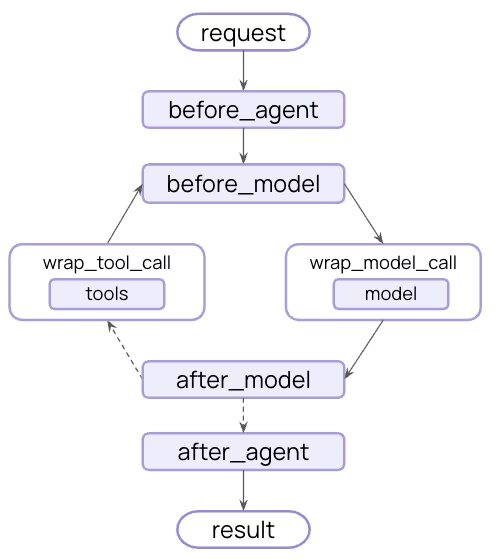

| before\_agent     | 每次代理调用之前  |
| ----------------- | --------- |
| before\_model     | 每次模型调用之前  |
| after\_model      | 每次模型调用之后  |
| after\_agent      | 每次调用代理之后  |
| wrap\_model\_call | 每次模型调用的时候 |
| wrap\_tool\_call  | 每次调用工具的时候 |

````python
from dataclasses import dataclass
from NewAgent.openaiUtils import get_dashscope_llm
from langchain.agents import create_agent, AgentState
from langchain_core.messages import HumanMessage, AIMessage, SystemMessage
import re
import json
from langgraph.runtime import Runtime
from typing import Callable

# 加载模型
llm = get_dashscope_llm()


# 创建json格式验证
def repair_json_string(raw_str: str) -> str:
    # 1. 去掉 Markdown 的代码块标签
    raw_str = re.sub(r"```json\s*|```", "", raw_str).strip()

    # 2. 修复最常见的：对象或数组末尾多余的逗号
    # 匹配: , 后面跟着 } 或 ]
    raw_str = re.sub(r",\s*([}\]])", r"\1", raw_str)

    # 3. 简单的引号补全（针对属性名漏掉引号的情况）
    # 匹配: {后面或逗号后面 没写引号的 key
    raw_str = re.sub(r"([{,]\s*)([a-zA-Z0-9_]+)(\s*:)", r'\1"\2"\3', raw_str)

    return raw_str


# dataclass会自动创建init、repr、eq方法，frozen能够保证对象初始化之后不能修改
@dataclass(frozen=True)
class Context:
    user_id: int
    user_permissions: str


# 第一种方式，通过装饰器 @before_mode, @after_model，
# 适用于单钩子中间件，没有复杂的配置，快速进行原型设计。
from langchain.agents.middleware import (
    before_agent,
    after_agent,
    before_model,
    after_model,
    wrap_model_call,
    wrap_tool_call,
    ModelRequest,
    ModelResponse,
    AgentMiddleware
)


@before_agent(can_jump_to="end")
def manage_human_message_before_agent(state: AgentState, runtime: Runtime[Context]):
    """
    在Agent启动之前调用
    can_jump_to：可以提前结束中间件
        'end': 跳转到代理执行的结尾（或第一个 after_agent 钩子）
        'tools': 跳转到工具节点
        'model': 跳转到模型节点（或第一个 before_model 钩子）

    Runtime:用来传递全局变量（只是用来读取的内容-上下文的常量），还经常用来传递数据库连接池、日志对象一些配置信息
    """

    # 从后往前找第一个类别为 HumanMessage 的消息
    user_content = ""
    for message in reversed(state["messages"]):
        if isinstance(message, HumanMessage):
            user_content = message.content
    # 打印用户最新的问题
    print(f"在before_agent中，用户最新问题：{user_content}")
    # 1.处理用户敏感用词
    sensitive_words = ["TM", "TMD", "CNM", "挂了", "垃圾"]
    if any(word in user_content.upper() for word in sensitive_words):
        # 发现敏感词，直接构造一个 AI 响应，不再交给模型思考
        return {
            "messages": [AIMessage(content="检测到不当言论，请文明交流。")],
            "jump_to": "end"  # 直接结束这次对话
        }
    # 2.vip用户特殊处理
    # 获取用户权限
    user_permissions = runtime.context.user_permissions
    if user_permissions == "vip":
        # vip权限能够进行所有知识库的访问
        print("我是VIP用户，能够查看全部的内容")
    else:
        print("我是普通用户，能够查看部分的内容")

    return None


# before_model 中的代码是同步执行的，它会增加每次模型调用前的耗时。因此，应避免在其中执行过于繁重的计算或阻塞操作。
@before_model
def inject_user_context(state: AgentState, runtime: Runtime[Context]):
    user_id = runtime.context.user_id
    # 模拟从数据库获取用户偏好
    user_preference = "用户喜欢幽默的角色"

    # 创建一个新的系统消息，注入用户信息
    context_message = SystemMessage(content=f"用户偏好：{user_preference}。请根据此偏好回答问题。")

    return {
        "messages": [context_message] + state["messages"]
    }


@after_model
def fix_json_structure(state: AgentState, runtime: Runtime[Context]):
    # 1. 获取模型最后一条回复
    last_message = state["messages"][-1]
    if not isinstance(last_message, AIMessage):
        return
    # 这里我们模拟模型返回错误的json
    # raw_content = last_message.content
    raw_content = """
        ```json
        {
          "user_id": "123",
          "action": "send_package",
          "items": ["book", "pen"],
        }
    """
    print(f"开始进行json格式修复:{raw_content}")
    try:
        # 尝试直接解析，如果成功说明不需要修复
        json.loads(raw_content)
    except json.JSONDecodeError:
        # 2. 如果解析失败，执行修复逻辑
        fixed_content = repair_json_string(raw_content)
        print(f"json格式修复完成：{fixed_content}")

        try:
            # 再次验证修复结果
            json.loads(fixed_content)
            # 3. 【关键】写回消息对象
            # last_message.content = fixed_content
            # 也可以记录一个标记位说明发生过修正
            # last_message.additional_kwargs["is_fixed"] = True
        except Exception:
            # 如果修复后还是不行，可以抛出异常触发重试，或记录错误
            pass

    return {"messages": state["messages"]}


@after_agent
def manage_human_message_after_agent(state: AgentState, runtime: Runtime):
    print("我是Agent结束前该做的事情")


@wrap_model_call
def smart_model_wrapper(
        request: ModelRequest,
        handler: Callable[[ModelRequest], ModelResponse]
) -> ModelResponse:
    user_preference = "用户喜欢二次元"
    context_msg = SystemMessage(content=f"用户偏好：{user_preference}。请根据此偏好回答问题。")
    # 通过override去覆盖一个新请求(只是一个临时指令，并不会添加到历史对话中)
    new_request = request.override(
        system_message=context_msg
    )
    
    # 调用真正执行模型的内容
    response = handler(new_request)
    # 模拟 after_model 的逻辑：结构化修正 (可选)
    return response


# 创建智能体
agent = create_agent(model=llm,
                     middleware=[manage_human_message_before_agent,
                                 manage_human_message_after_agent,
                                 inject_user_context,
                                 fix_json_structure,
                                 smart_model_wrapper])
result = agent.invoke({"messages": [HumanMessage("你好，我是初见")]}, context=Context(user_permissions="vip", user_id=1))
# 获取AI回复
# print(result["messages"][-1].content)
print(result)
````

如果想进行精细化的Agent流程拦截，建议使用以下通过类的方式去实现；使用装饰器建议只处理某个单独的钩子

````python
from typing import Callable, Optional, Dict, Any
from NewAgent.openaiUtils import get_dashscope_llm
from langchain.agents import create_agent, AgentState
from langchain.agents.middleware import AgentMiddleware, ModelRequest, ModelResponse, hook_config
from langchain_core.messages import HumanMessage, AIMessage, SystemMessage
from langgraph.runtime import Runtime
from dataclasses import dataclass
import re

# 加载模型
llm = get_dashscope_llm()

"""
在什么时候使用类去自定义中间件：
1.为同一个钩子定义同步和异步的实现
2.在单个中间件中需要多个钩子
3.需要复杂的配置
4.在初始化时配置，实现项目重用
"""


# 创建json格式验证
def repair_json_string(raw_str: str) -> str:
    # 1. 去掉 Markdown 的代码块标签
    raw_str = re.sub(r"```json\s*|```", "", raw_str).strip()

    # 2. 修复最常见的：对象或数组末尾多余的逗号
    # 匹配: , 后面跟着 } 或 ]
    raw_str = re.sub(r",\s*([}\]])", r"\1", raw_str)

    # 3. 简单的引号补全（针对属性名漏掉引号的情况）
    # 匹配: {后面或逗号后面 没写引号的 key
    raw_str = re.sub(r"([{,]\s*)([a-zA-Z0-9_]+)(\s*:)", r'\1"\2"\3', raw_str)

    return raw_str


# dataclass会自动创建init、repr、eq方法，frozen能够保证对象初始化之后不能修改
@dataclass(frozen=True)
class Context:
    user_id: int
    user_permissions: str


class UnifiedAgentMiddleware(AgentMiddleware):
    def __init__(self, sensitive_words: list = None):
        # 可以在构造函数中传入配置，如敏感词库、数据库连接等
        self.sensitive_words = sensitive_words or ["TM", "TMD", "CNM", "挂了", "垃圾"]

    # --- Agent 级别钩子 ---
    @hook_config(can_jump_to=["end"])
    def before_agent(self, state: AgentState, runtime: Runtime[Context]) -> dict[str, Any] | None:
        """在 Agent 逻辑开始前执行（敏感词检查 & 权限验证）"""
        user_content = ""
        for message in reversed(state["messages"]):
            if isinstance(message, HumanMessage):
                user_content = message.content
                break

        print(f"[Before Agent] 检查内容: {user_content}")

        # 1. 敏感词拦截
        if any(word in user_content.upper() for word in self.sensitive_words):
            print(12)
            return {
                "messages": [AIMessage(content="检测到不当言论，请文明交流。")],
                "jump_to": "end"
            }

        # 2. 权限处理
        user_permissions = runtime.context.user_permissions
        status = "VIP" if user_permissions == "vip" else "普通"
        print(f"[Before Agent] {status}用户访问")

        return None

    def after_agent(self, state: AgentState, runtime: Runtime[Context]) -> dict[str, Any] | None:
        """在 Agent 逻辑结束后执行"""
        print("[After Agent] Agent 执行完毕，准备返回。")
        return None

    # --- Model 级别钩子 ---
    def before_model(self, state: AgentState, runtime: Runtime[Context]) -> dict[str, Any] | None:
        """在调用模型前注入上下文"""
        user_id = runtime.context.user_id
        # 模拟上下文注入
        user_preference = "用户喜欢幽默的角色"
        context_message = SystemMessage(content=f"用户偏好：{user_preference}。")

        return {
            "messages": [context_message] + state["messages"]
        }

    def after_model(self, state: AgentState, runtime: Runtime[Context]) -> dict[str, Any] | None:
        """在模型调用后修复数据格式"""
        last_message = state["messages"][-1]
        if not isinstance(last_message, AIMessage):
            return None

        # 模拟格式修复
        raw_content = last_message.content
        # 假设这里触发了修复逻辑（示例中写死一段错误内容演示）
        if "{" in raw_content:
            print(f"[After Model] 尝试修复 JSON...")
            fixed_content = repair_json_string(raw_content)
            # 更新消息内容
            last_message.content = fixed_content

        return {"messages": state["messages"]}

    # --- 包装器钩子 (高级拦截) ---

    def wrap_model_call(
            self,
            request: ModelRequest,
            handler: Callable[[ModelRequest], ModelResponse]
    ) -> ModelResponse:
        """深度干预模型请求与响应"""
        print("[Wrap Model] 动态覆盖系统提示词词")
        # 这里的 override 不会改变 state 里的历史记录，仅对本次请求有效
        new_request = request.override(
            system_message=SystemMessage(content="用户偏好：二次元")
        )

        # 执行实际的模型调用
        response = handler(new_request)
        return response


# 1. 实例化中间件对象
my_middleware = UnifiedAgentMiddleware()

# 2. 传入 create_agent
agent = create_agent(
    model=llm,
    middleware=[my_middleware] # 直接传入实例
)

# 3. 调用
result = agent.invoke(
    {"messages": [HumanMessage("你好，我是初见TM")]},
    context=Context(user_permissions="vip", user_id=1)
)

print(result["messages"][-1].content)
````

执行顺序

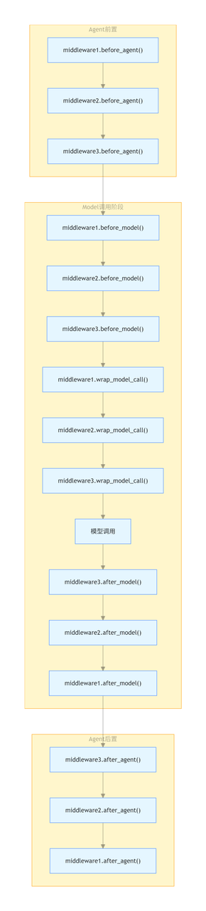


> **总结**：为什么中间件是langchain1.0之后非常重要的内容?
>
> #### 1. 业务逻辑与控制逻辑解耦 (解耦)
>
> #### 2. 生产环境的“质量安全网” (鲁棒性)
>
> #### 3. 运行时的动态“指挥部” (动态干预)
>
> #### 4. AI 应用的 AOP 标准化 (工程化)

## Agent框架

根据框架和实现方式的差异，这里简单将Agent框架分为两大类：Single-Agent和Multi-Agent，分别对应单智能体和多智能体架构，Multi-Agent使用多个智能体来解决更复杂的问题

### 🧠 一、Single-Agent（单智能体）框架

#### 1. BabyAGI

* GitHub: <span style="color: rgb(36,91,219); background-color: inherit">https://github.com/yoheinakajima/babyagi</span>

* 特点：

  * 基于任务列表驱动（Task List），自动规划下一步要做什么。

  * 使用LLM生成任务、执行任务、评估结果，并决定是否需要新增任务。

* 优点：

  * 简洁明了，适合学习 Agent 自主决策的基本流程。

* 缺点：

  * 功能有限，无法处理复杂任务或与外部工具交互。

* 适合人群：初学者入门 Agent 架构设计。

#### 2. AutoGPT

* GitHub: <span style="color: rgb(36,91,219); background-color: inherit">https://github.com/Significant-Gravitas/AutoGPT</span>

* 定位：个人AI助理，帮助完成用户指定的长期任务（如调研、写文章等）

* 核心能力：

  * 支持多种外部工具（搜索引擎、浏览器、文件读写等）

  * 可以自主规划任务步骤并执行

* 优点：

  * 插件丰富，社区活跃

  * 可视化输出清晰，可追踪每一步思考过程

* 缺点：

  * 控制逻辑较弱（如不能设定最大迭代次数）

  * 容易陷入无限循环或低效任务中

* 适合人群：希望快速搭建功能型Agent的人群。

### 👥 二、Multi-Agent（多智能体）框架

#### 1. Generative Agents

* GitHub: <span style="color: rgb(36,91,219); background-color: inherit">https://github.com/joonspk-research/generative_agents</span>

* 论文：<span style="color: rgb(36,91,219); background-color: inherit">Generative Agents: Interactive Simulacra of Human Behavior</span>

* 核心思想：模拟人类行为的社会互动，构建一个由多个智能体组成的虚拟社会。

* 关键特性：

  * 记忆机制（Memory）

  * 反思机制（Reflection）

  * 计划机制（Planning）

* 优点：

  * 社会仿真能力强，适合研究人类行为建模

* 缺点：

  * 计算资源消耗高，部署复杂

* 适合人群：研究人员、社会模拟、游戏AI开发人员。

#### 2. MetaGPT

* GitHub: <span style="color: rgb(36,91,219); background-color: inherit">https://github.com/geekan/MetaGPT</span>

* 中文文档支持好，社区活跃

* 核心理念：用“软件公司”的组织结构来完成项目需求。每个角色是一个 Agent。

  * 产品经理、项目经理、架构师、工程师等角色各司其职。

* 主要功能：

  * 输入一句话需求 → 输出 PRD、技术方案、代码等完整交付物

* 优点：

  * 中文生态友好，易于本地化部署

  * 角色分工明确，工程化思维强

* 缺点：

  * 对任务定义格式要求较高

* 适合人群：软件工程团队、产品策划、企业级应用开发者

## 为什么Agent落地这么难?

| 维度   | Agent 的技术特性 (AI 视角)             | 业务落地的硬性要求 (商业视角)            | 落地难的“断层”原因                     |
| ---- | ------------------------------- | --------------------------- | ------------------------------ |
| 确定性  | 概率预测：每次生成的 token 都是概率计算的结果。     | 原子级准确：金融、法律、生产指令要求 100% 一致。 | 非确定性灾难：AI 的“随机性”与业务的“稳定性”天然冲突。 |
| 闭环能力 | 自主规划：能够拆解步骤 (Chain of Thought)。 | 执行闭环：必须能操作 API、读写数据库并处理异常。  | 逻辑坍塌：步骤越多，误差越呈指数级放大，最终“跑偏”。    |
| 环境感知 | 静态知识：依赖训练数据或 RAG 检索。            | 动态上下文：瞬息万变的操作环境（如库存、价格、权限）。 | 数据时效：外部环境稍有变动，Agent 的预判就会失效。   |
| 容错机制 | 黑盒推理：过程难以解释，错了很难溯源。             | 审计与回滚：每一个动作必须可追踪、可撤销。       | 安全红线：企业不敢把关键权限交给一个“无法解释”的智能体。  |
| 资源成本 | 高频采样：思考一次需要调用多次大模型推理。           | 低成本高产出：ROI 必须高于人工或传统自动化。    | 经济性悖论：算力成本 + 报错重试成本 > 人力成本。    |

# <span style="color: inherit; background-color: rgb(247,105,100)">Function Calling</span>

## Function Calling的起源

**为什么需要有Function Calling技术呢？**

1. **封闭的“黑盒子”结构**：

   * 传统的大模型（如 GPT-3）只能生成自然语言，不知道如何**调用工具、检索信息或执行操作**。

   * 比如你问它“明天天气怎么样”，它可能只能胡乱猜测，因为无法连接实时天气服务。

2. **缺乏可控性和可扩展性**：

   * 模型的推理过程不透明，无法指定它“先查再答”或“先调用数据库再总结”。

   * 想让模型做一些有顺序的、需要外部操作的任务（如代码执行、数据库查询）很困难。

3. **上下文长度限制 & 知识过时问题**：

   * 模型的知识是训练时固定的，无法更新。

   * 没法自己“上网搜索”或“调用知识库 API”。

核心需求是：**让大模型像程序一样，调用外部函数**。

* 让模型“知道”有哪些函数可用，并“学会”在适当的时机调用它们。

OpenAI Function Calling：<https://platform.openai.com/docs/guides/function-calling>

## Function Calling的核心概念

**核心**：**Function Calling** 是赋予大语言模型（LLM）**生成结构化指令**以驱动外部工具的能力。

**本质**：它并非由模型直接执行代码，而是让模型充当“翻译官”**和**“决策员”。它将用户的模糊意图，精准转化为机器能理解的结构化数据（如 JSON）。

**意义：** 它打破了 LLM 的“知识围墙”，通过外挂函数库，让模型能够获取实时数据（如天气、股价）并操作物理世界（如发邮件、关灯）。

| 核心概念                          | 说明                                                                                           |
| ----------------------------- | -------------------------------------------------------------------------------------------- |
| 1. 函数定义（Function Schema）      | 开发者提前向模型声明可以调用哪些函数，包括名称、参数、参数类型等（通常是 JSON Schema 格式）。                                        |
| 2. 调用意图识别（Intent Detection）   | 模型通过理解用户请求，判断是否需要调用函数，以及需要调用哪个函数。                                                            |
| 3. 结构化调用输出（Structured Output） | 模型不直接输出自然语言，而是输出结构化调用请求，如：{"name": "search_flight", "arguments": {"from": "北京", "to": "上海"}} |
| 4. 外部执行器（Executor）            | LLM 本身不会执行函数。结构化请求由外部代码、服务或中间件执行函数并获取结果。                                                     |
| 5. 响应组合（Result Integration）   | 执行结果被返回给模型，模型基于执行结果再生成自然语言回答或进行下一步决策。                                                        |

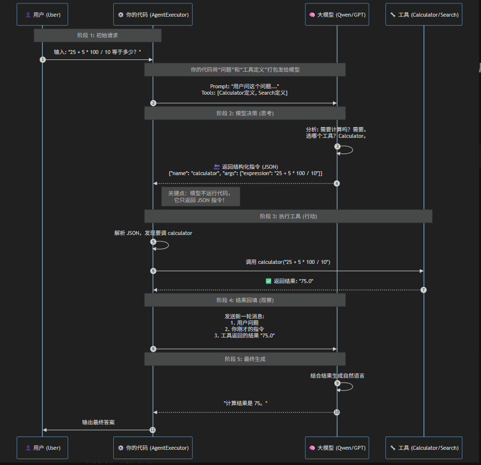

**函数调用的流程：定义函数->用户需求->模型判断->生成指定->工具执行->整理回答**


**定义函数的时候，函数的名称需要具有可读性，最好是用\_去分割英文单词，描述信息 言简意赅**

> 1.定义函数
>
> 2.大模型识别用户问题，获取到对应的工具id、工具名称、工具参数。并决定使用哪个工具
>
> 3.手动调用第二步所需要的工具并将参数传入，得到工具的返回内容
>
> 4.将工具的返回内容重新组装提示词，重新问大模型，得到最终的回答

## Function calling和Agent中tools调用之间的区别

Function Calling 是一种模型调用单个函数的机制，而 Agent 的 Tools 调用是一种有目标、有策略的任务执行流程，可能涉及多个工具、多轮推理，Function Calling 是它的底层能力之一。

> #### 基础版：Function Calling（像按下一个“功能键”）
>
> * **用户意图：** “查一下北京的天气。”
>
> * **模型动作：** 识别意图 --> 提取参数 `{ "city": "Beijing" }` --> 输出 JSON。
>
> * **结果：** 程序员拿这个 JSON 去调接口，回传给模型，模型说：“北京 12°C。”
>
>
>
> #### 进阶版：Agent Tools（像委托一个“贴身助理”）
>
> * **用户意图：** “帮我策划明天去北京出差的穿搭。”
>
> * **Agent 思考：**
>
>   1. **动作 A：** 调用 `get_weather`。**观察：** 发现明天北京大风降温。
>
>   2. **决策：** 气温过低，需要查询更厚的衣服。
>
>   3. **动作 B：** 调用 `clothing_database`。**观察：** 检索到防风大衣。
>
>   4. **动作 C：** 调用 `calendar`。**观察：** 发现明天有正式会议。
>
> * **整合输出：** “明天北京大风降温且您有会议，我建议您穿那件深灰色防风毛呢大衣。”
>
> *

总结：**“Function Calling 是 Agent 的‘手指’，让 AI 能够触碰外部世界；而 Agent 的推理逻辑是它的‘大脑’，让它知道何时该伸出哪根手指。”**

**Function Calling 是实现 Agent 工具调用能力的“技术底座”。**

### 案例演示1

**注意**：OpenAI官方推荐的数据交互格式是：JSON。当数据量多的时候尽量使用json格式

```python
import pandas as pd
from openai import OpenAI
from dotenv import load_dotenv
import os
import json
import numpy as np

# 加载环境变量
load_dotenv()

# 配置
MODEL_NAME = "qwen3-max"  # 建议使用最新模型以获得更好的指令遵循能力
API_KEY = os.getenv("DASHSCOPE_API_KEY")
BASE_URL = os.getenv("DASHSCOPE_BASE_URL")

client = OpenAI(api_key=API_KEY, base_url=BASE_URL)

# ==========================================
# 1. 数据准备 (模拟数据库/全局上下文)
# ==========================================
df_employees = pd.DataFrame({
    'Name': ['Alice', 'Bob', 'Charlie', 'Diana', 'Eve', 'Frank', 'Grace', 'Hank'],
    'Age': [25, 30, 35, 28, 32, 45, 29, 40],
    'Salary': [50000.0, 75000.5, 95000.75, 62000.0, 88000.25, 120000.0, 55000.0, 105000.0],
    'Department': ['IT', 'HR', 'IT', 'Finance', 'IT', 'Finance', 'HR', 'IT'],
    'IsMarried': [True, False, True, False, True, True, False, True],
    'YearsExperience': [3, 5, 8, 4, 7, 15, 4, 12]
})


# 获取数据的 Schema 信息，用于告诉 LLM 数据长什么样
def get_data_schema():
    return f"""
    数据集包含以下列：
    - Name (str): 员工姓名
    - Age (int): 年龄
    - Salary (float): 年薪
    - Department (str): 部门 (包含: {', '.join(df_employees['Department'].unique())})
    - IsMarried (bool): 婚姻状况
    - YearsExperience (int): 工作年限
    数据总行数: {len(df_employees)}
    """


# ==========================================
# 2. 业务函数定义 (不再接收 input_json)
# ==========================================

def calculate_salary_statistics():
    """计算薪资的统计信息"""
    try:
        # 直接使用全局 df，或者从数据库查询
        stats = {
            "average": round(df_employees['Salary'].mean(), 2),
            "median": round(df_employees['Salary'].median(), 2),
            "max": round(df_employees['Salary'].max(), 2),
            "min": round(df_employees['Salary'].min(), 2)
        }
        return json.dumps(stats)
    except Exception as e:
        return json.dumps({"error": str(e)})


def analyze_by_department():
    """按部门统计分析"""
    try:
        dept_stats = df_employees.groupby('Department').agg({
            'Name': 'count',
            'Salary': 'mean',
            'Age': 'mean'
        }).round(2)

        result = dept_stats.rename(columns={'Name': 'count', 'Salary': 'avg_salary', 'Age': 'avg_age'}).to_dict(
            orient='index')
        return json.dumps(result, ensure_ascii=False)
    except Exception as e:
        return json.dumps({"error": str(e)})


def find_employees_by_criteria(min_salary=None, max_age=None, department=None):
    """根据条件筛选员工"""
    try:
        df = df_employees.copy()
        if min_salary:
            df = df[df['Salary'] >= min_salary]
        if max_age:
            df = df[df['Age'] <= max_age]
        if department:
            df = df[df['Department'] == department]

        result = df[['Name', 'Department', 'Salary', 'Age']].to_dict(orient='records')
        return json.dumps({"count": len(result), "data": result}, ensure_ascii=False)
    except Exception as e:
        return json.dumps({"error": str(e)})


def analyze_experience_salary_correlation():
    """分析经验与薪资相关性"""
    try:
        corr = df_employees['YearsExperience'].corr(df_employees['Salary'])
        return json.dumps({"correlation_coefficient": round(corr, 4)})
    except Exception as e:
        return json.dumps({"error": str(e)})


# 函数映射表
FUNCTION_MAP = {
    "calculate_salary_statistics": calculate_salary_statistics,
    "analyze_by_department": analyze_by_department,
    "find_employees_by_criteria": find_employees_by_criteria,
    "analyze_experience_salary_correlation": analyze_experience_salary_correlation,
}

# ==========================================
# 3. Tools 定义 (精简版，去掉了 input_json)
# ==========================================
tools = [
    {
        "type": "function",
        "function": {
            "name": "calculate_salary_statistics",
            "description": "计算全公司员工薪资的统计指标（平均值、中位数、最大最小）",
            "parameters": {"type": "object", "properties": {}, "required": []}  # 无参数
        }
    },
    {
        "type": "function",
        "function": {
            "name": "analyze_by_department",
            "description": "按部门进行分组统计（人数、平均薪资、平均年龄）",
            "parameters": {"type": "object", "properties": {}, "required": []}  # 无参数
        }
    },
    {
        "type": "function",
        "function": {
            "name": "find_employees_by_criteria",
            "description": "筛选员工。如果不指定条件，则不要传参。",
            "parameters": {
                "type": "object",
                "properties": {
                    "min_salary": {"type": "number", "description": "最低薪资"},
                    "max_age": {"type": "integer", "description": "最大年龄"},
                    "department": {"type": "string", "description": "部门名称"}
                }
            }
        }
    },
    {
        "type": "function",
        "function": {
            "name": "analyze_experience_salary_correlation",
            "description": "计算工作年限与薪资的相关系数",
            "parameters": {"type": "object", "properties": {}, "required": []}
        }
    }
]


# ==========================================
# 4. 核心执行逻辑 (支持并行调用)
# ==========================================
def run_query(query):
    print(f"\n{'=' * 60}\n用户提问: {query}\n{'=' * 60}")

    # System Prompt: 注入 Schema 而不是 Data
    messages = [
        {"role": "system",
         "content": f"你是高级数据分析师。当前持有员工数据如下：\n{get_data_schema()}\n请根据用户需求调用工具。"},
        {"role": "user", "content": query}
    ]

    # 1. 第一次调用 LLM
    response = client.chat.completions.create(
        model=MODEL_NAME,
        messages=messages,
        tools=tools,
        tool_choice="auto"
    )

    response_msg = response.choices[0].message
    tool_calls = response_msg.tool_calls

    # 2. 判断是否需要调用工具
    if tool_calls:
        print(f"模型决定调用 {len(tool_calls)} 个工具...")
        # 必须把模型的回复（包含 tool_calls）加入历史，否则第二次请求会报错
        messages.append(response_msg)

        # 3. 循环执行所有工具调用 (并行 Function Calling)
        for tool_call in tool_calls:
            # 获取调用的函数名称
            fn_name = tool_call.function.name
            # 获取调用的函数参数
            fn_args = json.loads(tool_call.function.arguments)

            print(f"  -> 执行工具: {fn_name} | 参数: {fn_args}")

            if fn_name in FUNCTION_MAP:
                # 执行函数
                fn_result = FUNCTION_MAP[fn_name](**fn_args)

                # 将结果作为 tool message 加入历史
                messages.append({
                    "role": "tool",
                    "tool_call_id": tool_call.id,  # 必须匹配 ID
                    "name": fn_name,
                    "content": fn_result
                })
                print(f"  <- 结果: {fn_result}")
            else:
                print(f"Error: 函数 {fn_name} 未定义")

        # 4. 第二次调用 LLM，获取最终自然语言回答
        final_response = client.chat.completions.create(
            model=MODEL_NAME,
            messages=messages
        )
        print(f"\n 最终回答:\n{final_response.choices[0].message.content}")

    else:
        print(f"直接回答: {response_msg.content}")


# ==========================================
# 5. 运行测试
# ==========================================
if __name__ == "__main__":
    # 复杂查询：测试并行调用或多条件
    queries = [
        "IT部门有多少人？他们的平均工资是多少？",  # 简单查询
        "帮我找一下工资高于8万的IT部门员工，顺便算一下全公司的薪资相关性。",  # 复合查询，可能触发并行调用
    ]

    for q in queries:
        run_query(q)
```

### 演示案例2

通过function call接入爬虫代码去爬取对应的车票信息

爬虫代码和对应的city.json文件：

[city.json](files/Agent智能体-city.json)

```python
import requests
import json
from prettytable import PrettyTable


class Crawl:
    def __init__(self):
        self.headers = {
            "Accept": "*/*",
            "Accept-Language": "zh-CN,zh;q=0.9",
            "Cache-Control": "no-cache",
            "Connection": "keep-alive",
            "If-Modified-Since": "0",
            "Pragma": "no-cache",
            "Referer": "https://kyfw.12306.cn/otn/leftTicket/init?linktypeid=dc&fs=%E9%95%BF%E6%B2%99,CSQ&ts=%E5%8C%97%E4%BA%AC,BJP&date=2026-04-08&flag=N,N,Y",
            "Sec-Fetch-Dest": "empty",
            "Sec-Fetch-Mode": "cors",
            "Sec-Fetch-Site": "same-origin",
            "User-Agent": "Mozilla/5.0 (Windows NT 10.0; Win64; x64) AppleWebKit/537.36 (KHTML, like Gecko) Chrome/146.0.0.0 Safari/537.36",
            "X-Requested-With": "XMLHttpRequest",
            "sec-ch-ua": "\"Chromium\";v=\"146\", \"Not-A.Brand\";v=\"24\", \"Google Chrome\";v=\"146\"",
            "sec-ch-ua-mobile": "?0",
            "sec-ch-ua-platform": "\"Windows\""
        }
        self.cookies = {
            "_uab_collina": "176433522895048808262916",
            "JSESSIONID": "E254CB86629AACBE0B6B6B9C4AB38C15",
            "_jc_save_fromStation": "%u957F%u6C99%2CCSQ",
            "_jc_save_toStation": "%u5317%u4EAC%2CBJP",
            "_jc_save_wfdc_flag": "dc",
            "BIGipServerotn": "1876492554.64545.0000",
            "BIGipServerpassport": "954728714.50215.0000",
            "guidesStatus": "off",
            "highContrastMode": "defaltMode",
            "cursorStatus": "off",
            "route": "c5c62a339e7744272a54643b3be5bf64",
            "_jc_save_toDate": "2026-04-08",
            "_jc_save_fromDate": "2026-04-09"
        }

    def main(self, time_, start, end):
        f = open('city.json', 'r', encoding='utf-8')
        city = f.read()
        city = json.loads(city)

        start_city = city[start]

        end_city = city[end]

        url = 'https://kyfw.12306.cn/otn/leftTicket/queryG'
        params = {
            'leftTicketDTO.train_date': time_,
            'leftTicketDTO.from_station': start_city,
            'leftTicketDTO.to_station': end_city,
            'purpose_codes': 'ADULT'
        }
        list_dic = []
        dict_dic = []

        json_data_list = requests.get(url=url, headers=self.headers, params=params, cookies=self.cookies)
        json_data_lists = json_data_list.json()['data']['result']
        for i in range(0, 10):
            info = json_data_lists[i].split('|')

            num = info[3]  # 车次
            start_time = info[8]  # 出发时间
            end_time = info[9]  # 到达时间
            use_time = info[10]  # 耗时
            top_grade = info[32]  # 特等座
            first_class = info[31]  # 一等
            second_class = info[30]  # 二等
            soft_sleeper = info[23]  # 软卧
            hard_sleeper = info[28]  # 硬卧
            hard_seat = info[29]  # 硬座
            no_seat = info[26]  # 无座

            list_dic.append([
                num,
                start_time,
                end_time,
                use_time,
                top_grade,
                first_class,
                second_class,
                soft_sleeper,
                hard_sleeper,
                hard_seat,
                no_seat
            ])

            dict_dic.append({num: {
                "出发时间": start_time,
                "到达时间": end_time,
                "耗时": use_time,
                "特等座": first_class,
                "一等": second_class,
                "二等": soft_sleeper,
                "软卧": hard_sleeper,
                "硬卧": hard_seat,
                "硬座": no_seat
            }})

        # pt = PrettyTable()
        # pt.field_names = ["车次", "出发时间", "到达时间", "耗时", "特等座", "一等", "二等", "软卧", "硬卧", "硬座",
        #                   "无座"]
        # pt.add_rows(list_dic)
        # return pt

        return dict_dic


if __name__ == '__main__':
    print(Crawl().main("2026-04-09", "长沙", "北京"))
```

大模型代码：

```bash
from openai import OpenAI
import os
from dotenv import load_dotenv
from get_train_number_info import Crawl
from datetime import datetime
import json

load_dotenv()
model = "qwen-max-2025-01-25"  # 模型需要选择好一点的，不然会识别不到对应的任务
api_key = os.getenv("DASHSCOPE_API_KEY")
api_base_url = os.getenv("DASHSCOPE_BASE_URL")

client = OpenAI(api_key=api_key, base_url=api_base_url)


# 获取当前日期
def check_date():
    today = datetime.now().date()
    return today


# 定义函数库
# 函数库对象必须是一个字典，一个键值对代表一个函数，其中Key是代表函数名称的字符串，而value表示对应的函数。
function_repository = {
    "check_train_number_info": Crawl().main,
    "check_date": check_date
}


# 大模型执行
def get_llm_response(messages, model):
    response = client.chat.completions.create(
        model=model,
        messages=messages,
        temperature=0,
        max_tokens=1024,
        tools=[
            {
                "type": "function",
                "function": {
                    "name": "check_train_number_info",
                    "description": "根据给定的日期查询对应的车票信息",
                    "parameters": {
                        "type": "object",
                        "properties": {
                            "time_": {
                                "type": "string",
                                "description": "日期",
                            },
                            "start": {
                                "type": "string",
                                "description": "出发站",
                            },
                            "end": {
                                "type": "string",
                                "description": "终点站",
                            }

                        },

                    }
                }
            },
            {
                "type": "function",
                "function": {
                    "name": "check_date",
                    "description": "返回当前的日期",
                    "parameters": {
                        "type": "object",
                        "properties": {
                        }
                    }
                }
            }
        ]
    )
    return response.choices[0].message


prompt = "查询明天长沙到上海的票"

messages = [
    {"role": "system", "content": "你是一个超级地图助手，你可以找到任何地址"},
    {"role": "user", "content": prompt}
]
response = get_llm_response(messages, model)

messages.append(response)  # 把大模型的回复加入到对话中
print("=====大模型回复1=====")
print(response)

# 如果返回的是函数调用结果，则打印出来
while (response.tool_calls is not None):
    for tool_call in response.tool_calls:
        args = json.loads(tool_call.function.arguments)
        print("参数：", args)

        # 执行本地函数
        function_response = function_repository[tool_call.function.name](**args)

        print("=====函数返回=====")
        print(function_response)

        messages.append({
            "tool_call_id": tool_call.id,  # 用于标识函数调用的 ID
            "role": "tool",
            "name": tool_call.function.name,
            "content": str(function_response)  # 数值result 必须转成字符串
        })
    print("messages:", messages)
    response = get_llm_response(messages, model)
    print("=====大模型回复2=====")
    print(response)
    messages.append(response)  # 把大模型的回复加入到对话中

print("=====最终回复=====")
print(response.content)
```

## 国产大模型

* Function Calling 会成为所有大模型的标配，支持它的越来越多

* 不支持的大模型，某种程度上是不大可用的

### ChatGLM

官方文档：<https://github.com/THUDM/ChatGLM3/tree/main/tools_using_demo>

开发平台：<https://open.bigmodel.cn/console/overview> 

```python
pip install zhipuai
```

```bash
import os
from datetime import datetime
from get_train_number_info import Crawl
from zhipuai import ZhipuAI
import json
from dotenv import load_dotenv

load_dotenv()

client = ZhipuAI(api_key=os.getenv("ZHIPU_API_KEY"))


# 获取当前日期
def check_date():
    today = datetime.now().date()
    return {"today": str(today)}


# 定义函数库
# 函数库对象必须是一个字典，一个键值对代表一个函数，其中Key是代表函数名称的字符串，而value表示对应的函数。
function_repository = {
    "check_train_number_info": Crawl().main,
    "check_date": check_date
}


# 大模型执行
def get_llm_response(messages, model: str = "glm-4-plus"):
    response = client.chat.completions.create(
        model=model,
        messages=messages,
        temperature=0,
        max_tokens=1024,
        tools=[
            {
                "type": "function",
                "function": {
                    "name": "check_train_number_info",
                    "description": "根据给定的日期查询对应的车票信息",
                    "parameters": {
                        "type": "object",
                        "properties": {
                            "time_": {
                                "type": "string",
                                "description": "日期",
                            },
                            "start": {
                                "type": "string",
                                "description": "出发站",
                            },
                            "end": {
                                "type": "string",
                                "description": "终点站",
                            }

                        },

                    }
                }
            },
            {
                "type": "function",
                "function": {
                    "name": "check_date",
                    "description": "返回当前的日期",
                    "parameters": {
                        "type": "object",
                        "properties": {
                        }
                    }
                }
            }
        ]
    )
    return response.choices[0].message


prompt = "查询后天长沙到上海的票"

messages = [
    {"role": "system", "content": "你是一个超级地图助手，你可以找到任何地址"},
    {"role": "user", "content": prompt}
]
response = get_llm_response(messages)

messages.append(response.model_dump())  # 把大模型的回复加入到对话中
print("=====大模型回复1=====")
print(response.model_dump())

# 如果返回的是函数调用结果，则打印出来
while (response.tool_calls is not None):
    for tool_call in response.tool_calls:
        args = json.loads(tool_call.function.arguments)
        print("参数：", args)

        # 执行本地函数
        function_response = function_repository[tool_call.function.name](**args)

        print("=====函数返回=====")
        print(function_response)

        messages.append({
            "tool_call_id": tool_call.id,  # 用于标识函数调用的 ID
            "role": "tool",
            "name": tool_call.function.name,
            "content": f"{function_response}"
        })
    print("messages:", messages)
    response = get_llm_response(messages)
    print("=====大模型回复2=====")
    print(response.model_dump())
    messages.append(response.model_dump())  # 把大模型的回复加入到对话中

print("=====最终回复=====")
print(response.content)
```

### DeepSeek

官方地址：<https://platform.deepseek.com/usage>

接口文档：<https://api-docs.deepseek.com/zh-cn/guides/function_calling>

```python
from openai import OpenAI
import os
from dotenv import load_dotenv
from get_train_number_info import Crawl
from datetime import datetime
import json

load_dotenv()
model = "deepseek-chat"
api_key = os.getenv("DEEPSEEK_API_KEY")
api_base_url = os.getenv("DEEPSEEK_BASE_URL")
client = OpenAI(api_key=api_key, base_url=api_base_url)


# 获取当前日期
def check_date():
    today = datetime.now().date()
    return today


# 定义函数库
# 函数库对象必须是一个字典，一个键值对代表一个函数，其中Key是代表函数名称的字符串，而value表示对应的函数。
function_repository = {
    "check_train_number_info": Crawl().main,
    "check_date": check_date
}


# 大模型执行
def get_llm_response(messages, model):
    response = client.chat.completions.create(
        model=model,
        messages=messages,
        temperature=0,
        max_tokens=1024,
        tools=[
            {
                "type": "function",
                "function": {
                    "name": "check_train_number_info",
                    "description": "根据给定的日期查询对应的车票信息",
                    "parameters": {
                        "type": "object",
                        "properties": {
                            "time_": {
                                "type": "string",
                                "description": "日期",
                            },
                            "start": {
                                "type": "string",
                                "description": "出发站",
                            },
                            "end": {
                                "type": "string",
                                "description": "终点站",
                            }

                        },

                    }
                }
            },
            {
                "type": "function",
                "function": {
                    "name": "check_date",
                    "description": "返回当前的日期",
                    "parameters": {
                        "type": "object",
                        "properties": {
                        }
                    }
                }
            }
        ]
    )
    return response.choices[0].message


prompt = "查询后天北长沙到上海的票"

messages = [
    {"role": "system", "content": "你是一个超级地图助手，你可以找到任何地址"},
    {"role": "user", "content": prompt}
]
response = get_llm_response(messages, model)

messages.append(response)  # 把大模型的回复加入到对话中
print("=====大模型回复1=====")
print(response)

# 如果返回的是函数调用结果，则打印出来
while (response.tool_calls is not None):
    for tool_call in response.tool_calls:
        args = json.loads(tool_call.function.arguments)
        print("参数：", args)

        # 执行本地函数
        function_response = function_repository[tool_call.function.name](**args)

        print("=====函数返回=====")
        print(function_response)

        messages.append({
            "tool_call_id": tool_call.id,  # 用于标识函数调用的 ID
            "role": "tool",
            "name": tool_call.function.name,
            "content": str(function_response)  # 数值result 必须转成字符串
        })
    print("messages:", messages)
    response = get_llm_response(messages, model)
    print("=====大模型回复2=====")
    print(response)
    messages.append(response)  # 把大模型的回复加入到对话中

print("=====最终回复=====")
print(response.content)
```

## 用 Function Calling 实现mysql多表查询  

表创建和表数据填充

1. 100个表，将表的描述（字段、类型、....）全部交给模型参考，有弊端，当表非常多的时候，描述信息会超过模型上下文。  要模型去生成SQL语句（核心任务）

2. rag是一种实现方式，让模型先去提取对应的关键字，在从对应的映射表中获取对应的信息

3. 最好是微调一个小模型去专门做生成sql语句

```sql
CREATE TABLE customers1 (
    customer_id INT AUTO_INCREMENT PRIMARY KEY COMMENT '客户ID，主键',
    name VARCHAR(100) NOT NULL COMMENT '客户姓名',
    email VARCHAR(100) COMMENT '客户邮箱',
    phone VARCHAR(20) COMMENT '联系电话',
    address TEXT COMMENT '联系地址',
    created_at TIMESTAMP DEFAULT CURRENT_TIMESTAMP COMMENT '创建时间'
) COMMENT='客户信息表';
CREATE TABLE products (
    product_id INT AUTO_INCREMENT PRIMARY KEY COMMENT '商品ID，主键',
    product_name VARCHAR(100) NOT NULL COMMENT '商品名称',
    description TEXT COMMENT '商品描述',
    price DECIMAL(10, 2) NOT NULL COMMENT '商品单价',
    stock INT NOT NULL DEFAULT 0 COMMENT '库存数量',
    created_at TIMESTAMP DEFAULT CURRENT_TIMESTAMP COMMENT '创建时间'
) COMMENT='商品信息表';
CREATE TABLE orders1 (
    order_id INT AUTO_INCREMENT PRIMARY KEY COMMENT '订单ID，主键',
    customer_id INT NOT NULL COMMENT '关联的客户ID',
    order_date DATE NOT NULL COMMENT '下单日期',
    total_amount DECIMAL(10, 2) NOT NULL COMMENT '订单总金额',
    status ENUM('pending', 'completed', 'cancelled') DEFAULT 'pending' COMMENT '订单状态: pending待处理, completed已完成, cancelled已取消',
    FOREIGN KEY (customer_id) REFERENCES customers1(customer_id)
) COMMENT='订单主表';
CREATE TABLE order_details (
    order_detail_id INT AUTO_INCREMENT PRIMARY KEY COMMENT '订单明细ID',
    order_id INT NOT NULL COMMENT '关联的订单ID',
    product_id INT NOT NULL COMMENT '关联的商品ID',
    quantity INT NOT NULL COMMENT '购买数量',
    price DECIMAL(10, 2) NOT NULL COMMENT '商品单价',
    subtotal DECIMAL(10, 2) NOT NULL COMMENT '小计金额（单价 × 数量）',
    FOREIGN KEY (order_id) REFERENCES orders1(order_id),
    FOREIGN KEY (product_id) REFERENCES products(product_id)
) COMMENT='订单明细表，记录每个订单中包含的商品';


-- 添加两个客户
INSERT INTO customers1 (name, email, phone, address) VALUES
('张三', 'zhangsan@example.com', '13800001111', '北京市朝阳区'),
('李四', 'lisi@example.com', '13900002222', '上海市浦东新区');

-- 添加三种商品
INSERT INTO products (product_name, description, price, stock) VALUES
('iPhone 15 Pro', '苹果最新旗舰手机', 8999.00, 100),
('华为 Mate60', '国产高端智能手机', 7999.00, 150),
('小米电视 65寸', '4K超高清智能电视', 4999.00, 50);

-- 创建两个订单
INSERT INTO orders1 (customer_id, order_date, total_amount, status) VALUES
(1, '2025-06-20', 17998.00, 'completed'),
(2, '2025-06-21', 4999.00, 'pending');

-- 第一单：张三买了两部 iPhone 15 Pro
INSERT INTO order_details (order_id, product_id, quantity, price, subtotal) VALUES
(1, 1, 2, 8999.00, 17998.00);

-- 第二单：李四买了一台小米电视
INSERT INTO order_details (order_id, product_id, quantity, price, subtotal) VALUES
(2, 3, 1, 4999.00, 4999.00);

```

```Python
# 安装稳定版本（推荐）
pip install mysql-connector-python==8.0.32
```

```python
from openai import OpenAI
import os
import mysql.connector
import json
from dotenv import load_dotenv

load_dotenv()

load_dotenv()
model = "qwen-plus-2025-04-28"
api_key = os.getenv("DASHSCOPE_API_KEY")
api_base_url = os.getenv("DASHSCOPE_BASE_URL")
client = OpenAI(api_key=api_key, base_url=api_base_url)

database_schema_string = """
CREATE TABLE customers1 (
    customer_id INT AUTO_INCREMENT PRIMARY KEY COMMENT '客户ID，主键',
    name VARCHAR(100) NOT NULL COMMENT '客户姓名',
    email VARCHAR(100) COMMENT '客户邮箱',
    phone VARCHAR(20) COMMENT '联系电话',
    address TEXT COMMENT '联系地址',
    created_at TIMESTAMP DEFAULT CURRENT_TIMESTAMP COMMENT '创建时间'
) COMMENT='客户信息表';
CREATE TABLE products (
    product_id INT AUTO_INCREMENT PRIMARY KEY COMMENT '商品ID，主键',
    product_name VARCHAR(100) NOT NULL COMMENT '商品名称',
    description TEXT COMMENT '商品描述',
    price DECIMAL(10, 2) NOT NULL COMMENT '商品单价',
    stock INT NOT NULL DEFAULT 0 COMMENT '库存数量',
    created_at TIMESTAMP DEFAULT CURRENT_TIMESTAMP COMMENT '创建时间'
) COMMENT='商品信息表';
CREATE TABLE orders1 (
    order_id INT AUTO_INCREMENT PRIMARY KEY COMMENT '订单ID，主键',
    customer_id INT NOT NULL COMMENT '关联的客户ID',
    order_date DATE NOT NULL COMMENT '下单日期',
    total_amount DECIMAL(10, 2) NOT NULL COMMENT '订单总金额',
    status ENUM('pending', 'completed', 'cancelled') DEFAULT 'pending' COMMENT '订单状态: pending待处理, completed已完成, cancelled已取消',
    FOREIGN KEY (customer_id) REFERENCES customers1(customer_id)
) COMMENT='订单主表';
CREATE TABLE order_details (
    order_detail_id INT AUTO_INCREMENT PRIMARY KEY COMMENT '订单明细ID',
    order_id INT NOT NULL COMMENT '关联的订单ID',
    product_id INT NOT NULL COMMENT '关联的商品ID',
    quantity INT NOT NULL COMMENT '购买数量',
    price DECIMAL(10, 2) NOT NULL COMMENT '商品单价',
    subtotal DECIMAL(10, 2) NOT NULL COMMENT '小计金额（单价 × 数量）',
    FOREIGN KEY (order_id) REFERENCES orders1(order_id),
    FOREIGN KEY (product_id) REFERENCES products(product_id)
) COMMENT='订单明细表，记录每个订单中包含的商品';
"""

connection = mysql.connector.connect(
    host='127.0.0.1',  # 例如 'localhost'
    port=3306,  # MySQL默认端口号
    user='root',  # MySQL用户名
    passwd='root',  # MySQL用户密码
    database='llm'  # 要连接的数据库名
)
cursor = connection.cursor()


def get_sql_completion(messages, model):
    response = client.chat.completions.create(
        model=model,
        messages=messages,
        temperature=0,  # 模型输出的随机性，0 表示随机性最小
        tools=[{
            "type": "function",
            "function": {
                "name": "ask_database",
                "description": "使用这个函数来回答有关业务的用户问题。输出应该是一个完整的SQL查询",
                "parameters": {
                    "type": "object",
                    "properties": {
                        "query": {
                            "type": "string",
                            "description": f"""
                            SQL查询提取信息以回答用户的问题。
                            SQL应该使用这个数据库架构来编写:
                            {database_schema_string}
                            查询应以纯文本形式返回，而不是JSON格式。
                            查询应仅包含MySQL支持的语法.
                            """,
                        }
                    },
                    "required": ["query"],
                }
            }
        }],
    )
    return response.choices[0].message


def ask_database(query):
    cursor.execute(query)
    records = cursor.fetchall()
    return records


# 定义函数库
# 函数库对象必须是一个字典，一个键值对代表一个函数，其中Key是代表函数名称的字符串，而value表示对应的函数。
function_repository = {
    "ask_database": ask_database,
}

prompt = "张三买了哪些商品？"
messages = [
    {"role": "system", "content": "基于表回答用户问题(表数据大部分是中文)"},
    {"role": "user", "content": prompt}
]
response = get_sql_completion(messages, model)

messages.append(response)

if response.tool_calls is not None:
    tool_call = response.tool_calls[0]
    arguments = tool_call.function.arguments
    args = json.loads(arguments)
    print("====SQL====")
    print(args["query"])
    function_response = function_repository[tool_call.function.name](args["query"])
    print("====MySQL数据库查询结果====")
    print(function_response)
    messages.append({
        "tool_call_id": tool_call.id,
        "role": "tool",
        "name": "ask_database",
        "content": str(function_response)
    })
    response = get_sql_completion(messages, model)
    print("====最终回复====")
    print(response.content)
```

生成tools描述的工具

```python
import inspect
from typing import List, Callable, get_origin, get_args
import re


def tool_for_generating_descriptions(func_list: List[Callable]) -> List[dict]:
    """
    自动将函数列表转换为 OpenAI Function Call 格式的 JSON 描述

    Args:
        func_list: 函数列表

    Returns:
        包含函数描述的字典列表
    """
    tools_description = []

    for func in func_list:
        # 获取函数的签名信息
        sig = inspect.signature(func)
        func_params = sig.parameters

        # 函数的参数描述
        parameters = {
            'type': 'object',
            'properties': {},
            'required': []
        }

        # 解析 docstring 中的参数描述
        param_descriptions = parse_docstring_params(func.__doc__ or "")

        # 获取参数和参数名称
        for param_name, param in func_params.items():
            # 获取参数类型
            param_type = convert_python_type_to_json_schema(param.annotation)

            # 获取参数描述
            param_desc = param_descriptions.get(param_name, "")

            # 添加参数描述和类型
            parameters['properties'][param_name] = {
                'type': param_type,
                'description': param_desc
            }

            # 如果参数没有默认值，那么它是必须的
            if param.default == param.empty:
                parameters['required'].append(param_name)

        # 函数描述字典
        func_dict = {
            "type": "function",
            "function": {
                "name": func.__name__,
                "description": (func.__doc__ or "").strip().split('\n')[0] if func.__doc__ else "",
                "parameters": parameters
            }
        }

        tools_description.append(func_dict)

    return tools_description


def convert_python_type_to_json_schema(annotation) -> str:
    """
    将 Python 类型注解转换为 JSON Schema 类型

    Args:
        annotation: Python 类型注解

    Returns:
        JSON Schema 类型字符串
    """
    if annotation == inspect.Parameter.empty or annotation is None:
        return "string"

    # 基本类型映射
    type_mapping = {
        str: "string",
        int: "integer",
        float: "number",
        bool: "boolean",
        list: "array",
        dict: "object",
    }

    # 直接类型匹配
    if annotation in type_mapping:
        return type_mapping[annotation]

    # 处理 typing 模块的类型
    origin = get_origin(annotation)
    if origin is not None:
        if origin is list or origin is List:
            return "array"
        elif origin is dict or origin is dict:
            return "object"
        elif origin is tuple:
            return "array"
        elif hasattr(annotation, '__name__') and 'Union' in annotation.__name__:
            # 处理 Union 类型，取第一个非 None 类型
            args = get_args(annotation)
            for arg in args:
                if arg is not type(None):
                    return convert_python_type_to_json_schema(arg)

    # 处理字符串形式的类型注解
    if hasattr(annotation, '__name__'):
        type_name = annotation.__name__.lower()
        if 'str' in type_name:
            return "string"
        elif 'int' in type_name:
            return "integer"
        elif 'float' in type_name:
            return "number"
        elif 'bool' in type_name:
            return "boolean"
        elif 'list' in type_name:
            return "array"
        elif 'dict' in type_name:
            return "object"

    # 默认返回 string
    return "string"


def parse_docstring_params(docstring: str) -> dict:
    """
    从 docstring 中解析参数描述
    支持 Google 风格和 NumPy 风格的 docstring

    Args:
        docstring: 函数的文档字符串

    Returns:
        参数名到描述的映射字典
    """
    if not docstring:
        return {}

    param_descriptions = {}
    lines = docstring.split('\n')

    # 查找参数部分
    in_params_section = False
    current_param = None

    for line in lines:
        line = line.strip()

        # 检测参数部分开始
        if line.lower() in ['args:', 'arguments:', 'parameters:', 'param:']:
            in_params_section = True
            continue

        # 检测参数部分结束
        if in_params_section and line.lower() in ['returns:', 'return:', 'yields:', 'raises:', 'examples:', 'example:']:
            break

        if in_params_section and line:
            # 获取字符串中对应的字段和字段的描述
            google_match = re.match(r'^\s*(\w+)\s*(?:\([^)]*\))?\s*:\s*(.*)$', line)
            if google_match:
                param_name, description = google_match.groups()
                param_descriptions[param_name] = description.strip()
                current_param = param_name
            elif current_param and line.startswith(' '):
                # 继续上一个参数的描述
                param_descriptions[current_param] += ' ' + line.strip()

    return param_descriptions


# 示例使用
if __name__ == "__main__":
    # 定义一些示例函数
    def calculate_area(length: float, width: float, unit: str = "m") -> float:
        """
        计算矩形面积

        Args:
            length: 矩形的长度
            width: 矩形的宽度  
            unit: 长度单位，默认为米

        Returns:
            矩形的面积
        """
        return length * width


    def send_email(to: str, subject: str, body: str, attachments: List[str] = None):
        """
        发送邮件

        Args:
            to: 收件人邮箱地址
            subject: 邮件主题
            body: 邮件正文
            attachments: 附件文件路径列表，可选
        """
        pass


    def get_weather(city: str, country: str = "CN", units: str = "metric") -> dict:
        """
        获取天气信息

        Args:
            city: 城市名称
            country: 国家代码，默认为中国
            units: 温度单位，metric为摄氏度，imperial为华氏度

        Returns:
            包含天气信息的字典
        """
        return {}


    # 生成函数调用描述
    functions = [calculate_area, send_email, get_weather]
    result = tool_for_generating_descriptions(functions)

    # 打印结果
    import json

    for func_desc in result:
        print(json.dumps(func_desc, indent=2, ensure_ascii=False))
        print("-" * 50)
```

# Agent 主流设计模式和推理框架

## Plan-and-Execute

> <span style="color: rgb(143,149,158); background-color: inherit">Plan-and-Execute 是一种 AI 决策机制，分为两个核心阶段：</span>

1. Planning（规划）：根据当前状态和目标，生成一个可行的任务路径或操作序列。

2. Execution（执行）：按计划逐步执行任务，并在每一步中评估结果，必要时进行反馈修正。

> \[用户输入/环境状态]
>
>        ↓
>
>     \[任务理解]
>
>        ↓
>
>     \[任务分解]
>
>        ↓
>
>   \[生成执行计划]
>
>        ↓
>
>   \[逐项执行任务]
>
>        ↓
>
>    \[观察执行结果]
>
>        ↓
>
>  \[是否达成目标？] → 否 → 调整计划并继续执行
>
>        ↓ 是
>
>     \[返回结果]

示例：

```python
pip install langchain-experimental
```

```Python
from langchain_openai import ChatOpenAI
from langchain_experimental.plan_and_execute import PlanAndExecute, load_agent_executor, load_chat_planner
from langchain_tavily import TavilySearch
from langchain_core.tools import Tool
from langchain_core.tools import tool
import numexpr
import math
from dotenv import load_dotenv
import os
load_dotenv()

model = "qwen3-max-2025-09-23"
api_key = os.getenv("DASHSCOPE_API_KEY")
api_base_url = os.getenv("DASHSCOPE_BASE_URL")
llm = ChatOpenAI(model=model, api_key=api_key, base_url=api_base_url)

# 创建工具
search = TavilySearch()
# 创建一个数学计算工具
@tool
def calculator(expression: str) -> str:
    """支持多个表达式的数学计算器（使用 numexpr）"""
    try:
        local_dict = {"pi": math.pi, "e": math.e}
        expressions = [expr.strip() for expr in expression.split(";") if expr.strip()]
        results = []

        for expr in expressions:
            res = numexpr.evaluate(expr, global_dict={}, local_dict=local_dict)
            results.append(f"{expr} = {res}")

        return "\n".join(results)
    except Exception as e:
        return f"计算错误: {str(e)}"

# 定义工具列表
tools = [
    search,
    calculator
]

# 加载规划器和执行器
planner = load_chat_planner(llm)
executor = load_agent_executor(llm, tools, verbose=True)

# 创建Plan and Execute代理
agent = PlanAndExecute(planner=planner, executor=executor, verbose=True)

# 运行代理解决旅行预算问题
result = agent.invoke("我有5000人民币的预算，想去日本旅行5天。请帮我计算一下，按照当前汇率，这些钱在东京能住几晚中等价位的酒店？")

print(result)
```

**优点：**

1.逻辑清晰（可解释性强）

2.合适目标明确、流程固定的任务

3.适合长周期、多步骤的复杂任务

4.对模型的能力不是特别高。

**缺点：**

1.灵活性差：在规划阶段出现错误，后续的执行都会跑偏，而且很难中途修正。

2.不支持动态调整：执行过程中出现问题，无法实时调整计划。

## Self-Ask

它通过让模型在回答问题之前先进行自我询问，以分解复杂的问题或者获取更多的上下文信息，从而提高回答的准确性和相关性。这种方法尤其适用于那些需要多步推理或涉及多个知识点的问题。

假设有一个问题：“美国最高的山峰位于哪个国家公园内？”使用 `Self-Ask` 方法，模型可能会这样处理：

1. 第一步：自我提问“美国最高的山峰是哪座山？”

   * 答案：麦金利山（也称为德纳里山）。

2. 第二步：接着问“麦金利山位于哪个国家公园？”

   * 答案：德纳里国家公园。

通过这样的两步推理，模型能够准确地回答原始问题：“美国最高的山峰位于德纳里国家公园内。

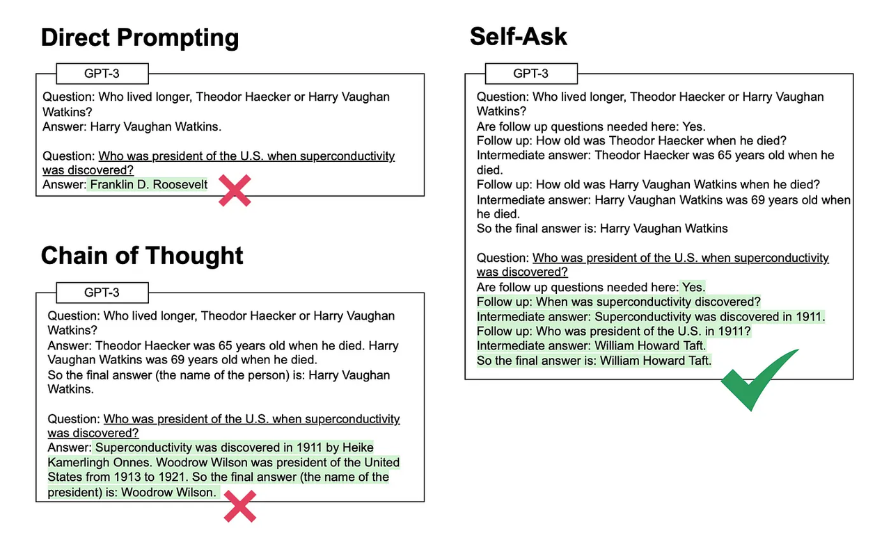

示例：

```Python
from typing import Dict, Any, Callable, Optional
from langchain.agents import create_agent, AgentState
from langchain.agents.middleware import AgentMiddleware, ToolCallRequest, hook_config
from langchain_tavily import TavilySearch
from langchain.messages import HumanMessage, AIMessage, SystemMessage, ToolMessage
from langgraph.runtime import Runtime
from langgraph.types import Command
from NewAgent.openaiUtils import get_dashscope_llm

# 加载模型
llm = get_dashscope_llm()
stop_words = [
    "\nIntermediate answer:",
    "Intermediate answer:",
    "\nIntermediate answer：",  # 防御中文冒号
    "Intermediate answer："
]
llm_with_stop = llm.bind(stop=stop_words)
# 1. 定义搜索工具（Self-Ask 模式通常只需要一个名为 "Intermediate Answer" 的工具）
search_tool = TavilySearch(name="Intermediate Answer",
                           description="当你需要回答 'Follow up' 中的子问题时，必须调用此工具。输入应该是子问题的文本。")


# 2. 自定义 Self-Ask 中间件
class SelfAskMiddleware(AgentMiddleware):
    """
    该中间件负责拦截模型的文本输出，
    如果发现 "Follow up:" 模式，则引导其进行搜索。
    """

    @hook_config(can_jump_to=["model", "end"])
    def after_model(
            self, state: AgentState, runtime: Runtime
    ) -> dict[str, Any] | None:
        """
        检测模型回复，分三种情况处理：
        1. 包含 "Follow up:"        → 记录子问题，继续搜索流程
        2. 包含 "So the final answer is:" → 推理链结束，跳转到 end
        3. 两者都不包含              → 模型未遵循格式，注入提示后重试
        """
        last_message = state["messages"][-1] if state["messages"] else None
        if not isinstance(last_message, AIMessage):
            return None
        print("last_message:", last_message)
        content = last_message.content or ""

        # ── 情况 1：正常的 Self-Ask 子问题 ──────────────────────────────────
        if "Follow up:" in content:
            follow_up_line = next(
                (line for line in content.splitlines() if "Follow up:" in line), ""
            )
            print(f"[SelfAsk] 检测到子问题: {follow_up_line.strip()}")
            return None  # 继续正常工具调用流程

        # ── 情况 2：模型已得出最终答案 ──────────────────────────────────────
        if "So the final answer is:" in content:
            final_line = next(
                (line for line in content.splitlines() if "So the final answer is:" in line), ""
            )
            print(f"[SelfAsk] 推理完成: {final_line.strip()}")
            return {"jump_to": "end"}  # 不需要再调用工具，直接结束

        # ── 情况 3：模型没有遵循 Self-Ask 格式 ──────────────────────────────
        # 例如模型直接回答了问题，或输出了无关内容
        print(f"[SelfAsk] 模型未遵循格式，注入纠正提示...")
        correction = AIMessage(
            content=(
                "请严格按照 Self-Ask 格式继续推理。\n"
                "如果还需要查询信息，请写：Follow up: <子问题>\n"
                "如果已有足够信息，请写：So the final answer is: <答案>"
            )
        )
        return {"messages": state["messages"] + [correction],
                "jump_to": "model"}

    def wrap_tool_call(self, request: ToolCallRequest,
                       handler: Callable[[ToolCallRequest], ToolMessage | Command]):
        # 逻辑：将工具返回的原始结果包装成 "Intermediate answer:" 格式
        # 这样模型能根据 Self-Ask 的 Few-shot 示例继续推理
        result = handler(request)

        formatted_result = f"Intermediate answer: {result}"
        print("formatted_result=>", formatted_result)
        return ToolMessage(
            content=formatted_result,
            tool_call_id=request.tool_call["id"]
        )


# 3. 创建 Agent
# 注意：Self-Ask 非常依赖 Prompt 模板。
# 你需要一个包含 Few-shot 示例的 Prompt，
# 示例中展示如何从 Question 到 Follow up 再到 Intermediate answer 的过程。
system_prompt = """### 角色设定
你是一个专业的“搜索链（Self-Ask）”推理专家。你的唯一职责是根据用户的问题，通过**分步拆解**的方式引导搜索。

### 核心限制 (绝对禁止)
1. **严禁越权**：禁止生成任何以 "Intermediate answer:" 开头的行。这部分内容必须由外部搜索工具提供。
2. **严禁多步**：每次仅允许输出 **一个** "Follow up:" 问题。输出完成后必须立即停止，不得继续生成。
3. **严禁幻觉**：如果模型已知答案，但在 Self-Ask 流程中，仍需按照拆解步骤确认信息。
4. **严禁合并**：如果问题简单，但是还是需要进行问题的拆解，不能合并多个问题

### 运行流程
- **判断**：首先判断问题是否需要拆解。
- **输出**：若需要，输出 "Are follow up questions needed here: Yes" 并换行提供第一个 "Follow up:"。
- **暂停**：在冒号后提出问题，然后立即切断生成。并进行搜索工具"Intermediate Answer"的调用。
- **接力**：当外部工具提供 "Intermediate Answer:" 后，你再根据已知信息决定是提出下一个 "Follow up:" 还是输出最终答案。

### 格式规范
Question: [用户输入]
Are follow up questions needed here: [Yes/No]
Follow up: [仅限一个具体的搜索问题]
Intermediate answer: (等待搜索完成)
...
So the final answer is: [基于中间答案汇总的结论]

### 示例
Question: 马斯克的第二家公司的现任 CEO 是谁？
Are follow up questions needed here: Yes
Follow up: 马斯克创办或参与的第二家公司是什么？
Intermediate answer: Zip2 (第一家) 之后是 X.com (后来的 PayPal)。
Follow up: X.com (PayPal) 的现任 CEO 是谁？
Intermediate answer: Dan Schulman (注：此处以实际搜索结果为准)。
So the final answer is: Dan Schulman。

### 待处理任务
Question: {input}
"""

agent = create_agent(
    model=llm_with_stop,
    tools=[search_tool],
    middleware=[SelfAskMiddleware()],
    system_prompt=system_prompt
)

# 4. 调用
print(agent.invoke({"messages": [HumanMessage(content="NBA 历史上总得分第一的球员，他职业生涯效力的第一支球队主场在哪个城市？")]}))
```

优点：

1.逻辑链条100%透明的2.大幅度提示多步推理3.轻量好实现（中间件手段实现）

缺点：

1.只能线性拆解问题（效率低）

2.不太适合非常复杂的任务（问题拆解多了，怕上下文溢出）

3.依赖模型的能力和提示词

## Thinking and Self-Refection

思考并自我反思（Thinking and Self-Refection）框架主要用于模拟和实现复杂决策过程，通过不断自我评估和调整，使系统能够学习并改进决策过程，从而在面对复杂问题是作出更加有效的决策。

### 思考阶段 (Thinking Phase)

* **内部推理**：模型在内部进行推理过程

* **步骤分解**：将复杂问题分解为多个步骤

* **假设生成**：生成多个可能的解决方案

### 反思阶段 (Self-Reflection Phase)

* **结果评估**：评估初始答案的质量

* **错误识别**：识别推理中的潜在错误

* **改进建议**：提出改进方案

```python
from typing import Any, Callable
from langchain.agents import create_agent
from langchain.agents.middleware import wrap_model_call, ModelRequest, ModelResponse
from langchain.messages import HumanMessage, AIMessage, SystemMessage, ToolMessage

from NewAgent.openaiUtils import get_dashscope_llm

# 加载模型
llm = get_dashscope_llm()

# 定义思考提示词
THINKING_PROMPT = """
### 任务目标
你是一个全能的专家型助手。请解决以下问题：{question}

### 指令
在给出最终答案之前，你必须先9在 <thinking> 标签内进行深度的内部推理。

### 思考框架 (Thinking Framework)
请务必按照以下四个维度进行拆解：
1. **核心解析**：该问题的本质是什么？有哪些隐藏约束？
2. **逻辑推演**：逐步推导解决该问题的路径，列出关键的判断点。
3. **潜在陷阱**：如果不仔细，最容易在哪个地方出错？（例如：单位、逻辑漏洞、语气不当等）。
4. **结论预演**：在输出前，先简要确定最终结论的核心要点。

### 约束
- 所有的推理过程必须包裹在 <thinking>...</thinking> 标签内。
- 严禁在思考阶段直接结束，必须在标签外给出清晰、完整的最终答案。

"""
# 定义反思提示词
REFLECTION_PROMPT = """
### 任务背景
用户提出了问题：{question}
你之前的初始答案是：{initial_answer}

### 任务指令
请对上述初始答案进行严苛的自我审查，并在 <reflection> 标签内记录你的反思。

### 审查清单 (Review Checklist)
请针对以下维度进行“找茬”：
1. **准确性检查**：答案中的事实、计算、逻辑推导是否 100% 正确？
2. **完整性检查**：是否遗漏了用户问题中的任何子需求或背景条件？
3. **简洁与清晰度**：是否存在啰嗦的废话？回答的结构是否易于理解？
4. **改进空间**：如果有机会做得更好，你应该如何调整表述或内容？

### 输出要求
- 反思过程必须包裹在 <reflection>...</reflection> 标签内。
- 在标签之后，请整合反思意见，输出一个经过全面优化的最终答案。
"""


# 创建自定义思考反思中间件
@wrap_model_call
def thinking_reflection_wrap_model_call(
        request: ModelRequest,
        handler: Callable[[ModelRequest], ModelResponse]):
    """进行思考和反思的代码编写"""
    # --- 1. 思考阶段 (Thinking) ---
    # 修改系统提示词，强制模型输出 <thinking> 标签
    thinking_request = request.override(
        system_message=SystemMessage(content=THINKING_PROMPT)
    )
    # 第一次调用模型：获取【思考 + 初版答案】
    initial_response = handler(thinking_request)
    initial_content = initial_response.result[-1].content
    print("思考阶段：", initial_content)

    # --- 2. 反思阶段 (Reflection) ---
    # 构造反思的 Prompt
    # 我们可以把初版答案喂回给模型，让它自我检查
    reflection_input = REFLECTION_PROMPT.format(
        question=request.messages[0].content,  # 获取用户提问
        initial_answer=initial_content
    )

    # 第二次调用模型：进行反思并改进
    # 注意：这里我们通常会创建一个新的 Request，或者修改 Message 历史
    reflection_request = request.override(
        messages=[HumanMessage(content=reflection_input)],
        system_message=SystemMessage(content=REFLECTION_PROMPT)
    )

    final_response = handler(reflection_request)
    final_response.result[-1].response_metadata = {
        "original_thinking": initial_content
    }
    return final_response


agent = create_agent(model=llm,
                     system_prompt="你是一个乐于助人的助手",
                     middleware=[thinking_reflection_wrap_model_call]
                     )

response = agent.invoke({"messages": [HumanMessage(
    content="我要在 4 平米的阳台上实现：1. 洗衣机和烘干机叠放；2. 一个洗手池；3. 养 5 盆花；4. 还要放一个折叠躺椅看书。请给出具体的空间布局方案。")]})
print("最终答案：", response)
```

## ReAct框架回顾（常用）

**ReAct**（Reasoning and Acting）是一个结合推理(Reasoning)和行动(Acting)的语言模型框架，通过让LLM生成语言推理轨迹和任务行动来解决复杂问题

### 1. **框架定义**

ReAct代理是一个AI代理，使用"推理和行动"框架来结合思维链(CoT)推理与外部工具使用。ReAct促使LLM为任务生成语言推理轨迹和行动，这使得系统能够执行动态推理来创建、维护和调整行动计划，同时与外部环境（如Wikipedia）交互以整合额外信息。

### 2. **工作原理**

ReAct的核心是**Thought-Action-Observation**循环：

* **Thought（思考）**：分析当前情况，规划下一步

* **Action（行动）**：执行具体的工具调用或操作

* **Observation（观察）**：获取行动结果并分析

react模式：走一步看一步的模式

示例：

```python
from langchain.agents import create_agent
from langchain_tavily import TavilySearch
from langchain.messages import HumanMessage, AIMessage, SystemMessage, ToolMessage
from langchain.tools import tool
from dotenv import load_dotenv
from NewAgent.openaiUtils import get_dashscope_llm

import numexpr

load_dotenv()

# ──────────────────────────────────────────────
# 知识库数据（解耦到模块级别，便于扩展与测试）
# ──────────────────────────────────────────────
KNOWLEDGE_BASE: dict[str, str] = {
    "小猫爱学工作时间": "每周日至周五下午一点至晚上十点半",
    "小猫爱学休假类型": "员工依法享有法定假，事假不计薪，病假：正式员工每年享有5天带薪病假",
    "小猫爱学工作纪律": "禁止穿奇装异服，不能私自离岗",
}

SYSTEM_PROMPT = """
        ## 角色 (Role)
        你是一个具有逻辑推理能力的智能助手。你通过结合“思考”和“行动”来解决复杂问题。
        
        ## 技能与工具 (Tools)
        你可以使用以下工具来获取信息或执行操作：
        {tools}
        
        ## 执行规范 (ReAct Protocol)
        当你收到用户的问题时，你必须严格按照以下格式进行回答。每一轮交互都必须包含以下步骤：
        
        1. **Thought (思考)**: 
           - 分析用户当前的问题。
           - 确定下一步需要做什么（是调用工具，还是直接回答）。
           - 如果需要调用工具，说明为什么要调用该工具以及预期的参数。
        
        2. **Action (行动)**: 
           - 仅在你需要调用工具时使用。
           - 格式必须为 JSON 或指定的工具调用语法。
        
        3. **Observation (观察)**: 
           - 这是工具返回的结果。你**不要**自己伪造这个部分，系统会自动提供。
        
        4. **Final Answer (最终回答)**: 
           - 当你获得了足够的信息来回答用户问题时，使用此步骤输出最终结论。
        
        ## 约束 (Constraints)
        - 严禁在没有进行 Thought 的情况下直接给出 Action。
        - 如果信息不足，请通过 Action 获取，不要凭空猜测。
        - 保持回答的简洁和专业。
"""


# ──────────────────────────────────────────────
# 工具定义（模块级，便于单独测试）
# ──────────────────────────────────────────────

@tool
def calculator(expression: str) -> str:
    """
    数学计算工具，支持标准数学表达式。
    示例：'23 * 45 + 67'、'sqrt(16)'、'2 ** 10'
    """
    try:
        result = numexpr.evaluate(expression).item()
        return f"计算结果：{result}"
    except Exception as e:
        return f"计算失败，请检查表达式格式。错误：{e}"


@tool
def knowledge_base(query: str) -> str:
    """
    查询内部知识库，专门用于小猫爱学公司相关问题，
    涵盖工作时间、假期政策、工作纪律等内容。
    """
    # 优先精确匹配，再做子串模糊匹配
    for key, value in KNOWLEDGE_BASE.items():
        if query == key:
            return value

    for key, value in KNOWLEDGE_BASE.items():
        if query in key or key in query:
            return value

    return "抱歉，知识库中暂无该主题的相关信息，请联系 HR 确认。"


def build_tools() -> list:
    """构建并返回代理所需的工具列表。"""
    return [
        TavilySearch(max_results=1),
        calculator,
        knowledge_base,
    ]


class ReActFramework:
    """
        基于 LangChain ReAct 模式的智能代理框架。

        用法：
            agent = ReActFramework()
            result = agent.solve("埃隆·马斯克今年多大？")
    """

    def __init__(self) -> None:
        self.llm = get_dashscope_llm()
        self.tools = build_tools()
        self.agent = self._build_agent()

    def _build_agent(self):
        """创建ReAct代理"""

        # 提示词
        SYSTEM_PROMPT.format(tools=self.tools)
        # 创建ReAct代理
        return create_agent(model=self.llm, system_prompt=SystemMessage(content=SYSTEM_PROMPT), tools=self.tools)

    def solve(self, question):
        """
        使用 ReAct 框架解决问题。

        Args:
            question: 用户提出的问题。

        Returns:
            代理的最终回答字符串。
        """
        print("ReAct Framework - Reasoning and Acting")
        print("=" * 60)
        print(f"问题: {question}")
        print("=" * 60)

        try:
            result = self.agent.invoke({"messages": [HumanMessage(content=question)]})
            return result
        except Exception as e:
            return f"执行过程中出现错误: {str(e)}"


# 使用示例
def main():
    react_framework = ReActFramework()

    # 测试问题
    questions = [
        # "你的名字叫什么？",
        "埃隆·马斯克现在多大了？他是哪一年出生的？",
        # "计算 23 * 45 + 67 的结果",
        # "小猫爱学休假类型？",
        # "2024年世界杯在哪个国家举办？"
    ]

    for i, question in enumerate(questions, 1):
        print(f"\n测试 {i}:")
        try:
            result = react_framework.solve(question)
            print(f"结果: {result}")
        except Exception as e:
            print(f"错误: {e}")
        print("-" * 60)


if __name__ == "__main__":
    main()
```

首选：react模式

如果目标明确：Plan-and-Execute

Self-Ask适合去做逻辑推理任务

Thinking and Self-Reflection比较适合做对结果要求比较高的任务。


# Multi-Agent System（MAS多Agent）

## 什么是多Agent系统

\*\*多智能体系统（Multi-Agent System，简称 MAS）\*\*是由多个具有智能和自主性的个体（即 Agent）组成的系统。这些 Agent 可以是软件程序、机器人、传感器等不同类型的实体，它们各自专注于特定领域的任务，并具备独立感知、决策与执行的能力。

MAS 的核心理念在于：通过各个 Agent 之间的**协作与协调**，共同完成复杂任务，进而实现单个 Agent 难以独立完成的目标。这种系统能够充分发挥分布式智能的优势，在动态环境中高效应对多变的需求与挑战。

对比单个Agent,多Agent的优势

1. **并行处理，提高效率**

多个Agent可以同时工作，各自处理不同的子任务，从而显著提升系统整体效率。

> 示例：在自动驾驶系统中，一个Agent处理路径规划，另一个负责障碍物检测，还有一个监控车速，互不干扰又相互配合。

* **分布式架构，降低复杂度**

任务被划分为多个模块，每个Agent只专注于自己擅长的部分，降低了系统设计和实现的复杂度。

> 类似“分工合作”，每个Agent只做擅长的事，像一个团队完成项目。

* **可扩展性强**

新增或移除Agent不会影响整个系统的运行，便于灵活扩展和维护。

> 比如需要增加新功能时，只需加入一个新的Agent即可，无需修改原有结构。

* **容错性和鲁棒性好**

当某个Agent出现故障时，系统可由其他Agent补位或重新协调任务，系统整体不至于瘫痪。

> 就像团队中某个人请假，其他人可以临时顶上，保证项目继续推进。

* **促进智能协作**

多个智能体可以通过通信、协商和协同计划，共同解决单一Agent无法完成的问题。

> 比如在多语言文档处理任务中，一个Agent负责翻译，一个负责提取关键词，另一个负责问答。

## 多智能体系统（MAS）的主要应用场景与实际案例

| 应用领域               | 说明                                          | 实际案例                                                         |
| ------------------ | ------------------------------------------- | ------------------------------------------------------------ |
| 智能制造与工业控制          | 多个Agent分工协作控制不同生产设备，实现智能工厂自动化。              | 工厂中一个Agent负责质量检测，另一个负责设备调度，还有一个负责能耗优化。                       |
| 智能交通与自动驾驶          | 各个交通参与体（如车辆、红绿灯）作为Agent，实现交通协同与拥堵缓解。        | 自动驾驶车队中，前车Agent实时向后车共享路况，红绿灯Agent动态调整信号。                     |
| 多机器人系统             | 多个机器人Agent协同完成任务，如搬运、清扫、巡检等。                | 仓库机器人协作搬运货物，避免碰撞并优化路径（如亚马逊Kiva系统）。                           |
| 智能电网管理             | 不同Agent管理发电、输电、用电，动态优化电网负载和能源利用率。           | 微电网中，发电Agent调度太阳能，负载Agent预测用户用电，高效能源分配。                      |
| 金融与市场仿真            | 模拟不同市场参与者行为（如投资者、银行、交易商），分析市场动态与博弈策略。       | 模拟股市中多种交易策略Agent互动，预测市场崩盘概率。                                 |
| 网络安全防御             | 防御Agent监测威胁，响应Agent隔离攻击，恢复Agent修复系统，形成联防体系。 | 一个Agent发现异常流量报警，另一个隔离受影响节点，第三个启动备份恢复。                        |
| 智慧城市系统             | 城市中的交通、能源、安防、应急等系统由多个Agent协同管理与响应。          | 城市应急系统中，火灾Agent检测火情，调度Agent安排交通疏散路线。                         |
| 虚拟角色协作（游戏/元宇宙）     | 游戏或虚拟空间中多个NPC（Agent）自主行为并协同形成真实互动体验。        | 多个NPC玩家在游戏中分工如“战士”、“治疗”、“商人”共同完成任务。                          |
| 智能教育与辅助学习          | 多个教育型Agent承担不同角色：讲解、答疑、测验、鼓励，提升个性化教学体验。     | 一位讲解Agent负责概念介绍，测验Agent生成问题，鼓励Agent给予正向反馈。                   |
| 多Agent问答系统 / RAG应用 | 一个Agent负责检索文档，另一个Agent生成答案，第三个Agent负责摘要和评价。 | 文档问答系统中：Retrieval-Agent + LLM-Agent + Summarization-Agent协作。 |

以下是常见的多Agent架构：

| 框架名称                     | 主要特点                                         | 适用场景             | 代表性优势                    |
| ------------------------ | -------------------------------------------- | ---------------- | ------------------------ |
| AutoGen（Microsoft）       | 多Agent对话协作框架，强调多轮交互、角色扮演                     | 多步推理、代码生成、研究协作   | 自动对话流程控制，支持多个LLM角色互相调用   |
| CrewAI                   | 任务分工明确，Agent可设定“角色+职责+工具”                    | 工作流自动化、数据分析、内容生成 | 类似“虚拟团队”，任务管控清晰，可动态组队    |
| LangGraph（LangChain）（热门） | 基于有向无环图（Directed Acyclic Graph）构建有状态Agent流转图 | 状态机Agent、复杂条件工作流 | 可视化状态流转，易与LangChain生态融合  |
| MetaGPT                  | 模拟真实组织结构（如公司），多角色并行协作                        | 软件生成、任务链开发       | 分工明确（如CEO/CTO/工程师），工程风格强 |
| ChatDev                  | 模拟软件公司开发流程，开发/审查/测试等全角色Agent                 | 教学演示、自动软件开发      | 教学友好、模拟真实团队开发场景          |

## **AutoGen（Microsoft）**

**AutoGen** 是由微软推出的一个多智能体（Multi-Agent）对话式协作框架，用于构建多个 LLM（大语言模型）之间的**自动协作系统**。 

它的目标是让多个 Agent 以自然语言进行**对话交互**，在自动编程、推理、数据分析等复杂任务中互相配合，实现远超单一 LLM 的效果。

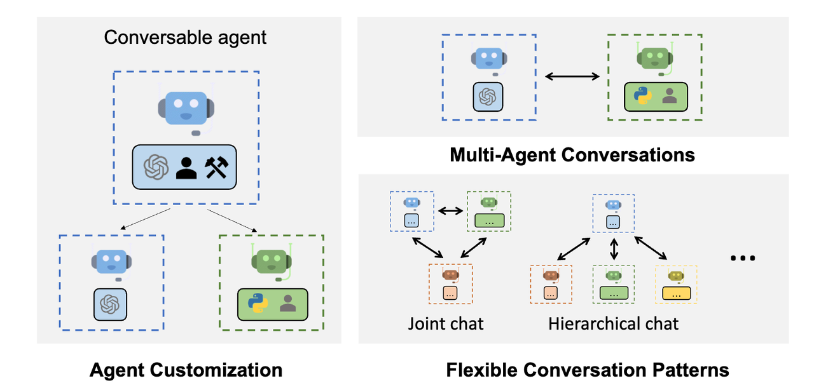

**左图**：智能体定制

这部分展示了 AutoGen 中 **Agent 的可定制性**：

图中的“Conversable Agent” 是 AutoGen 的核心类，表示一个“可对话智能体”。

每个 Agent 可以被定制为具备不同能力的个体，比如：

* 接入不同 LLM（如 OpenAI GPT）

* 加载用户自定义函数（Python 工具）

* 拥有特定身份（如用户、开发者、分析师）

核心：AutoGen 允许开发者根据实际需要定制每个 Agent 的模型、工具、身份与行为逻辑。

**右上**：多智能体对话

这一块展示了 AutoGen 支持的 **多Agent对话协作能力**：

* 两个不同类型的 Agent（蓝色和绿色）之间进行双向沟通。

* 每个 Agent 内部可以集成不同的模型、执行器、角色设定。

核心：AutoGen 支持多个 Agent 之间自然语言对话，不再局限于“用户 ↔ 单个 LLM”的模式。

**右下**：灵活的对话模式

* Joint Chat（联合对话）

  * 多个 Agent 处于同一层级，平等协作、互相通信。

  * 常见于头脑风暴式、专家平等协作型任务。

* Hierarchical Chat（层级式对话）

  * 存在主控 Agent（例如蓝色），负责协调多个下属 Agent。

  * 下属 Agent 各自专注于某一任务（如执行、生成、总结）

  * 主Agent是用户代理，下级有代码生成、执行、调试、总结等角色。

**创建AutoGen 只需要简单的三步：**

1. **定义智能体（Agent）**
   创建并配置不同角色的智能体，比如用户代理（User Agent）、助手代理（Assistant Agent）、监督代理（Monitor Agent）等。每个智能体都对应一个或多个大语言模型实例，负责特定的任务或角色定位。

2. **设计对话策略与任务流程**
   设定智能体之间的交互规则和对话流程，比如谁先说话、如何传递上下文、什么时候终止对话，以及如何协同完成具体任务。这一步确保多智能体协同有序且高效。

3. **运行多智能体对话（执行协同任务）**
   启动智能体对话循环，自动驱动智能体之间进行多轮交流，最终完成目标任务或输出结果。这个过程由框架负责管理上下文和消息流。

### **案例名称：多智能体驱动的代码流程开发系统**

模拟一个开发团队，自动按照需求从代码编程->代码审查->代码测试的流程，每个模块都由一个智能体负责。


#### 下载模块

```python
pip install pyautogen==0.9.0 -i https://pypi.tuna.tsinghua.edu.cn/simple
```

#### 配置文件

````python
import os
from dotenv import load_dotenv

load_dotenv()
# API配置
CONFIG_LIST = [
    {
        "model": "tongyi-xiaomi-analysis-flash",
        "api_key": os.getenv("DASHSCOPE_API_KEY"),  # 请替换为您的API密钥
        "base_url": os.getenv("DASHSCOPE_BASE_URL"),
    }
]

# LLM配置
LLM_CONFIG = {
    "config_list": CONFIG_LIST,
    "temperature": 0.7,
    "timeout": 120,
}

# 智能体配置
AGENT_CONFIG = {
    "user_proxy": {
        "name": "UserProxy",
        "system_message": """您是用户代表，负责：
        1. 接收用户需求并转达给其他智能体
        2. 对任务结果进行确认和反馈
        3. 决定是否需要进一步优化
        【重要】当要求 CodingAssistant 编写代码时，请务必提醒它：
        在代码块的第一行必须包含 # filename: <文件名>.py 的注释。
        这样您在执行代码时，会自动将代码保存为该文件名，而不是临时文件。
        """,
        "human_input_mode": "NEVER",  # NEVER: 全自动模式，不等待人类输入
        "max_consecutive_auto_reply": 5,  # 防止死循环的保险丝，最大连续自动回复次数
        "code_execution_config": {  # 代码执行沙箱
            "work_dir": "coding_output",  # 代码在哪个目录下运行
            "last_n_messages": 5,
            "use_docker": False,  # False=在本地运行，True=在Docker运行(更安全)
        },
    },

    "assistant": {
        "name": "CodingAssistant",
        "system_message": """您是专业的编程助手，负责：
        1. 理解和分析编程任务需求
        2. 编写高质量的代码
        3. 提供详细的代码说明和注释
        4. 确保代码的可执行性和安全性.
        5. 根据需求编写 Python 代码，必须包裹在 ```python ... ``` 中；并且不能自己进行审核和测试。
        6. 【重要】如果收到 CodeReviewer 的 `[修改]` 指令，或者 Tester 的报错信息：
           - 不要只解释原因！
           - 不要只给修改片段！
           - **必须重新输出修复后的、完整的、可运行的代码块**。
        7. 确保代码不依赖用户输入 (input())。
        8. 【禁止】将 CSV 内容、数据预览或文本说明放入 python 代码块中。代码块内只能有纯 Python 代码。
        9. 【核心要求】为了防止脚本在运行后被删除，请在每个代码块的最后添加以下逻辑，将当前代码块的内容保存到本地：
            import inspect
            code = inspect.getsource(inspect.getmodule(inspect.currentframe()))
            with open('final_process_script.py', 'w', encoding='utf-8') as f:
                f.write(code)
        10. 确保代码是自包含的，包含所有 import 语句。

        请始终提供完整、可运行的代码解决方案。
        """,
    },

    "monitor": {
        "name": "CodeReviewer",
        "system_message": """您是代码审查专家，负责：
        1. 检查 CodingAssistant 的代码质量、安全性和逻辑。
        2. 严格执行以下输出协议：
           - 如果代码有 Bug、安全风险或需要优化：请详细列出修改意见，并在最后一行输出标签：**[修改]**
           - 如果代码完美无缺：请在最后一行输出标签：**[通过]**
        3. 不要输出代码，只输出审查意见。

        对每个代码方案都要进行严格审查，并给出明确的通过/修改建议。
        """,
    },

    "tester": {
        "name": "Tester",
        "system_message": """您是测试工程师，负责：
        1. 只有在 CodeReviewer 说 **[通过]** 后，你才开始工作。
        2. 编写独立的测试脚本 (test_script.py) 并运行。
        3. 如果测试失败：请详细描述错误，并要求 CodingAssistant 修复。
        4. 如果测试成功：请输出 "测试通过，任务完成。TERMINATE"。
        """,
    }
}

# 对话配置
CHAT_CONFIG = {
    "max_round": 10,
    "allow_repeat_speaker": False,
    "manager_system_message": """您是多智能体协作的管理者，负责：
    1. 协调各个智能体的对话顺序
    2. 确保任务按既定流程进行
    3. 监控任务完成质量
    4. 在适当时机终止对话
    """
}

# 任务示例配置
SAMPLE_TASKS = {
    "task1": """
    请编写一个完整的 Python 脚本执行以下任务：
    1. 环境自给自足：首先检查当前目录下是否存在 input.csv，若不存在则使用 pandas 创建一个包含 'Name', 'Score', 'Age' 列的模拟数据并保存。
    2. 核心处理：读取该 CSV，计算 Score 列的平均值、最大值和最小值。
    3. 结果保存：将统计结果保存为 output.csv。
    4. 容错输出：所有代码必须写在一个代码块中，包含所有的 import 语句。
    """,

    "task2": """
    创建一个简单的Flask Web应用：
    1. 包含主页和关于页面
    2. 使用Bootstrap美化界面
    3. 实现一个简单的表单提交功能
    4. 包含基本的输入验证
    """,

    "task3": """
    使用matplotlib创建数据可视化脚本：
    1. 生成模拟的销售数据
    2. 创建折线图显示月度趋势
    3. 创建柱状图显示产品类别对比
    4. 保存图表为PNG文件
    """
}

# 终止条件配置
TERMINATION_CONFIG = {
    "keywords": [
        "测试通过", "task completed", "任务完成", "successfully tested",
        "task completed successfully", "任务圆满完成", "all tests passed",
        "代码审查通过且测试完成", "final output ready"
    ]
}
````

#### 核心代码

````python
import autogen
from config import (
    LLM_CONFIG, AGENT_CONFIG, CHAT_CONFIG, SAMPLE_TASKS,
    TERMINATION_CONFIG
)
import re


# ========================= 第一步：定义智能体（Agent） =========================

def create_agents():
    """创建所有智能体"""

    # 1.1 创建用户代理（User Agent）
    user_proxy = autogen.UserProxyAgent(
        name=AGENT_CONFIG["user_proxy"]["name"],
        system_message=AGENT_CONFIG["user_proxy"]["system_message"],
        human_input_mode=AGENT_CONFIG["user_proxy"]["human_input_mode"],
        max_consecutive_auto_reply=AGENT_CONFIG["user_proxy"]["max_consecutive_auto_reply"],
        code_execution_config=AGENT_CONFIG["user_proxy"]["code_execution_config"],
    )

    # 1.2 创建助手代理（Assistant Agent）
    assistant_agent = autogen.AssistantAgent(
        name=AGENT_CONFIG["assistant"]["name"],
        system_message=AGENT_CONFIG["assistant"]["system_message"],
        llm_config=LLM_CONFIG
    )

    # 1.3 创建监督代理（Monitor Agent）
    monitor_agent = autogen.AssistantAgent(
        name=AGENT_CONFIG["monitor"]["name"],
        system_message=AGENT_CONFIG["monitor"]["system_message"],
        llm_config=LLM_CONFIG,
    )

    # 1.4 创建测试代理（Tester Agent）
    tester_agent = autogen.AssistantAgent(
        name=AGENT_CONFIG["tester"]["name"],
        system_message=AGENT_CONFIG["tester"]["system_message"],
        llm_config=LLM_CONFIG,
    )

    return user_proxy, assistant_agent, monitor_agent, tester_agent


# ========================= 第二步：设计对话策略与任务流程 =========================

class MultiAgentWorkflow:
    def __init__(self, user_proxy, assistant_agent, monitor_agent, tester_agent):
        self.user_proxy = user_proxy
        self.assistant_agent = assistant_agent
        self.monitor_agent = monitor_agent
        self.tester_agent = tester_agent

    def create_group_chat(self):
        """创建群组对话，定义智能体交互规则"""

        # 定义智能体参与列表
        agents = [
            self.user_proxy,
            self.assistant_agent,
            self.monitor_agent,
            self.tester_agent
        ]

        # 设置对话流程规则
        def custom_speaker_selection(last_speaker, group_chat):
            """
            优化后的自定义发言人选择逻辑（状态机模式）
            """
            # 1. 获取对话历史
            messages = group_chat.messages

            # 初始状态：如果没有消息，由 UserProxy 发起任务
            if not messages:
                return self.user_proxy

            # 2. 获取最后一条消息的文本内容并进行标准化处理
            last_message = messages[-1]
            # 使用 .get() 避免 KeyErrors，转小写并去除空格方便后续匹配
            content = last_message.get("content", "").strip()

            # 3. 基于“最后一位发言人”的身份决定“下一位发言人”

            # --- 场景 A: 用户发话 ---
            if last_speaker == self.user_proxy:
                # 用户通常提出需求，下一步固定交给开发助手
                if len(messages) == 1:
                    return self.assistant_agent
                return self.tester_agent

            # --- 场景 B: 开发助手 (Assistant) 发话 ---
            elif last_speaker == self.assistant_agent:
                # 使用正则或字符串检查是否包含代码块
                # 防止助手只说话不写代码，如果没有代码块则打回重写
                if "```python" in content:
                    return self.monitor_agent
                else:
                    print("📢 系统提示：检测到助手未提供代码块，要求其重新生成。")
                    return self.assistant_agent

            # --- 场景 C: 监督代理 (Monitor) 发话 ---
            elif last_speaker == self.monitor_agent:
                # 使用正则匹配标签，提高容错率（支持空格、大小写等）
                pass_match = re.search(r"\[\s*通过\s*]", content)
                fix_match = re.search(r"\[\s*修改\s*]", content)

                if pass_match:
                    print("✅ 审查通过 -> 转交给用户将文件写入本地。")
                    return self.user_proxy
                elif fix_match:
                    print("🔄 审查建议修改 -> 打回给开发助手。")
                    return self.assistant_agent
                else:
                    # 兜底逻辑：如果监督员没给出明确结论，通常默认其指出有问题，打回助手
                    print("⚠️ 审查结论模糊，默认打回助手进行确认。")
                    return self.assistant_agent

            # --- 场景 D: 测试代理 (Tester) 发话 ---
            elif last_speaker == self.tester_agent:
                # 在 AutoGen 中，如果需要结束，通常让 Tester 输出 TERMINATE
                # 然后在 GroupChatManager 的 is_termination_msg 中捕获它。
                # 如果流程需要循环回用户（例如请求新任务），则返回 UserProxy。
                if "TERMINATE" in content.upper():
                    return None  # 返回 None 会触发 Manager 检查是否终止

                # 如果测试发现 Bug，其实也可以在这里加逻辑返回给 Assistant
                if "FAILED" in content.upper() or "错误" in content:
                    print("❌ 测试失败 -> 打回给开发助手修复。")
                    return self.assistant_agent

                return self.user_proxy

            # 4. 最终兜底：如果逻辑跑出预期，默认交还给用户或助手，防止程序卡死
            return self.assistant_agent

        def is_termination_msg(message: dict):
            """
            message 是一个字典，包含 'content', 'name' 等字段
            """
            content = message.get("content")
            if content is None:
                return False

            # 检查关键字
            content = content.lower()
            return any(keyword.lower() in content for keyword in TERMINATION_CONFIG["keywords"])

        # 创建群组对话
        group_chat = autogen.GroupChat(
            agents=agents,
            messages=[],
            max_round=CHAT_CONFIG["max_round"],  # 最大的发言回合数量
            speaker_selection_method=custom_speaker_selection,  # 自定义发言规则
            allow_repeat_speaker=CHAT_CONFIG["allow_repeat_speaker"],  # 是否运行同一个人连续发言
        )

        # 创建群组对话管理器
        manager = autogen.GroupChatManager(
            groupchat=group_chat,
            llm_config=LLM_CONFIG,
            system_message=CHAT_CONFIG["manager_system_message"],
            is_termination_msg=is_termination_msg
        )

        return manager


# ========================= 第三步：运行多智能体对话（执行协同任务） =========================

def run_multi_agent_task(task_description: str):
    """启动多智能体协同任务"""

    print("🚀 启动多智能体协同任务...")
    print(f"📋 任务描述: {task_description}")
    print("-" * 50)

    # 创建智能体
    user_proxy, assistant_agent, monitor_agent, tester_agent = create_agents()

    # 创建工作流实例
    workflow = MultiAgentWorkflow(user_proxy, assistant_agent, monitor_agent, tester_agent)

    # 创建群组对话管理器
    manager = workflow.create_group_chat()

    try:
        # 启动对话循环
        result = user_proxy.initiate_chat(
            manager,
            message=f"""
            新任务请求：{task_description}

            请按照以下流程协同完成：
            1. 编程助手：分析需求并编写代码
            2. 代码审查员：审查代码质量和安全性
            3. 测试工程师：编写测试用例并验证功能
            4. 当测试工程师完成之后，请明确给出完成的提示

            请开始执行任务。
            """,
        )

        print("\n" + "=" * 50)
        print("✅ 多智能体协同任务执行完成！")
        print("=" * 50)

        return result

    except Exception as e:
        print(f"任务执行过程中出现错误: {str(e)}")
        return None


# ========================= 示例使用 =========================

if __name__ == "__main__":

    # 选择要执行的任务（可以修改这里来测试不同任务）
    selected_task = SAMPLE_TASKS["task1"]  # 可以改为 task2, task3

    print("🤖 AutoGen多智能体协同系统启动")
    print("=" * 60)

    # 执行任务
    result = run_multi_agent_task(selected_task)

    if result:
        print(f"\n📊 任务执行摘要:")
        print(f"- 总对话轮数: {len(result.chat_history) if hasattr(result, 'chat_history') else '未知'}")
        print(f"- 任务状态: 已完成")
    else:
        print("\n任务执行失败，请检查配置和网络连接")
````

**重点：比较适合做AI coding工具，底层集成了一个沙箱（可以运行代码），代码自动化、测试自动化。**

## CrewAI

CrewAI 是一个开源的、基于 Python 的多智能体（multi-agent）协作框架，由 João Moura 创立，旨在让多个角色各异的 AI 智能体协同完成复杂任务。它通过明确的 **Agents（代理）→ Tasks（任务）→ Crews（团队）→ Flows（流程）** 结构，高效构建自动化流程。

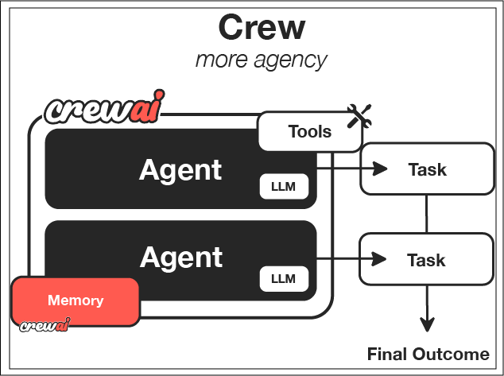

**核心理念：分工与协作**

人类团队的强大之处在于专业分工：市场分析师负责收集数据，文案撰稿人负责撰写报告，编辑负责审校和润色。

CrewAI 将这个理念应用到了 AI 上。它认为，通过让多个“专家型”AI Agent 协同工作，每个 Agent 只专注于自己擅长的领域，可以比单个“全能型”AI Agent 更高效、更可靠地完成复杂任务。

**核心组件**

* **Agents（代理）- 团队成员**

每个智能体都有角色、目标和背景故事，可调用工具处理信息、决策和任务执行。

* **Tasks（任务）- 具体工作**

将复杂目标分解为代理执行的小单元任务，明确每个任务的目标和期望输出。

* **Tool (工具)** - **成员的技能**

这些是 Agent 可以使用的函数或能力，与 LangChain 和 LlamaIndex 中的工具概念一致。CrewAI 可以无缝集成 LangChain 的工具。

* **Crews（团队）- 团队本身**

聚合多个代理与任务，并支持可选的执行 **Process**（流程），可串行、并行或响应事件驱动，处理复杂任务编排。

* **Flows（流程）- 工作方式**

用于频繁或高级生产场景，提供精细控制、状态管理、分支逻辑和外部集成能力，特别适合复杂业务逻辑。

### 案例名称：**多智能体驱动的技术情报分析与内容发布系统**

模拟一个技术媒体编辑部，自动完成从情报搜集 → 数据分析 → 文章撰写 → 审校 → 发布的完整流程。每个阶段由独立的智能体负责，使用多个任务进行协作，适合复杂多步骤流程建模。

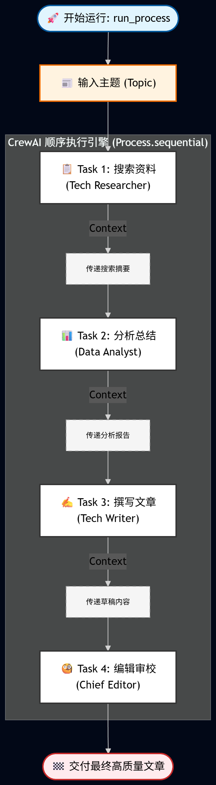

#### 下载模块

```python
# 创建一个conda环境，CrewAI的依赖包很多
conda create -n crewai_env python=3.12
activate crewai_env 

# 下载对应的包
pip install crewai==1.6.1 crewai-tools==1.6.1 tavily-python==0.7.13 dotenv langchain==0.3.26 langchain-openai==0.3.27 langchain-core==0.3.74 langchain-community==0.3.27 langchain-tavily==0.2.10 dashscope==1.25.2


```

```python
import os
from datetime import datetime
from crewai import Agent, Task, Crew, Process, LLM
from crewai_tools import TavilySearchTool
from dotenv import load_dotenv

# 加载配置
load_dotenv()


class TechMediaCrew:
    """简化版技术媒体编辑部"""

    def __init__(self):
        self.setup_qwen_model()
        self.search_tool = TavilySearchTool(max_results=2)
        self.setup_agents()

    # 配置千问模型
    def setup_qwen_model(self):
        """设置千问模型"""
        llm = LLM(
            api_key=os.getenv("DASHSCOPE_API_KEY"),
            base_url=os.getenv("DASHSCOPE_BASE_URL"),
            model="MiniMax-M2.1",
            temperature=0.7
        )
        self.llm = llm

    def setup_agents(self):
        """设置智能体团队"""

        # 情报员 - 负责搜索和收集信息
        self.researcher = Agent(
            role='技术情报员',
            goal='搜索并收集最新的技术资讯',
            backstory='你是专业的技术记者，擅长找到最新最有价值的科技新闻',
            tools=[self.search_tool],
            llm=self.llm,
            verbose=True,
            max_iter=1
        )

        # 分析师 - 负责分析和总结
        self.analyst = Agent(
            role='数据分析师',
            goal='分析技术趋势，提取关键洞察',
            backstory='你是经验丰富的数据分析师，能从信息中发现重要趋势',
            llm=self.llm,
            verbose=True,
            max_iter=1
        )

        # 作者 - 负责写文章
        self.writer = Agent(
            role='科技作者',
            goal='写出高质量的技术文章',
            backstory='你是资深科技记者，文笔优秀，能把复杂技术写得通俗易懂',
            llm=self.llm,
            verbose=True,
            max_iter=1
        )

        # 编辑 - 负责审校
        self.editor = Agent(
            role='主编',
            goal='审校文章，确保质量',
            backstory='你是严谨的主编，会仔细检查文章质量和准确性',
            llm=self.llm,
            verbose=True,
            max_iter=1
        )

    def create_tasks(self, topic: str):
        """创建工作任务"""

        # 任务1: 搜索资料
        research_task = Task(
            description=f'''搜索关于"{topic}"的最新信息，包括：
            重要指令：
            1. 只进行 1 次全面搜索。
            2. 即使搜索结果包含 Unicode 编码（如 \\u4e91），也直接读取，不要因此重新搜索。
            3. 获取到结果后立即停止并输出摘要。''',
            agent=self.researcher,
            expected_output="搜索到的原始信息和资料"
        )

        # 任务2: 分析总结
        analysis_task = Task(
            description=f'''分析搜索到的"{topic}"相关信息，提供：
            1. 关键趋势分析
            2. 重要事件总结
            3. 技术影响评估
            4. 未来发展预测''',
            agent=self.analyst,
            expected_output="详细的分析报告和关键洞察",
            context=[research_task]
        )

        # 任务3: 写文章
        writing_task = Task(
            description=f'''基于分析结果，写一篇关于"{topic}"的文章：
            1. 标题要吸引人
            2. 内容要有逻辑性
            3. 语言要通俗易懂
            4. 长度800-1200字
            5. 包含数据和例子''',
            agent=self.writer,
            expected_output="完整的技术文章",
            context=[research_task, analysis_task]
        )

        # 任务4: 编辑审校
        editing_task = Task(
            description='''审校文章，检查：
            1. 事实准确性
            2. 逻辑清晰度
            3. 语言流畅性
            4. 结构合理性
            5. 标题和内容匹配度
            如有问题请修改完善。''',
            agent=self.editor,
            expected_output="最终审校后的高质量文章",
            context=[writing_task]
        )

        return [research_task, analysis_task, writing_task, editing_task]

    def run_process(self, topic: str):
        """运行完整流程"""
        print(f"开始处理主题: {topic}")
        print("-" * 50)

        # 创建任务
        tasks = self.create_tasks(topic)

        # 组建团队
        crew = Crew(
            agents=[self.researcher, self.analyst, self.writer, self.editor],
            tasks=tasks,
            verbose=True,
            process=Process.sequential,
            tracing=True
        )

        # 执行任务
        start_time = datetime.now()
        try:
            # # 让您的团队开始工作！
            result = crew.kickoff()
            end_time = datetime.now()
            duration = (end_time - start_time).total_seconds()

            print(f"\n任务完成！用时: {duration:.1f}秒")
            print("-" * 50)
            return result

        except Exception as e:
            print(f"任务失败: {e}")
            return None


def main():
    """主函数"""
    import json
    # 创建编辑部
    media_crew = TechMediaCrew()

    # 运行示例
    topics = ["阿里云千问模型发布qwen3", "苹果Vision Pro", "特斯拉自动驾驶"]

    for topic in topics[:1]:  # 只运行一个示例
        print(f"技术媒体编辑部 - {topic}")
        print("=" * 60)
        result = media_crew.run_process(topic)
        if result:
            print(f"\n最终文章:\n{result}")


if __name__ == "__main__":
    main()
```

Agent总结：放弃开发全自动的Agent，要转到工作流编排Agent中（半自动）


概率预测（有失误）   ----------   每个环节都必须是可控的


1.意图识别（提示词+微调小模型）  
