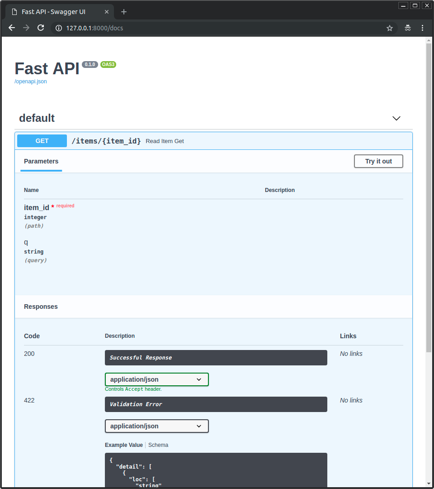
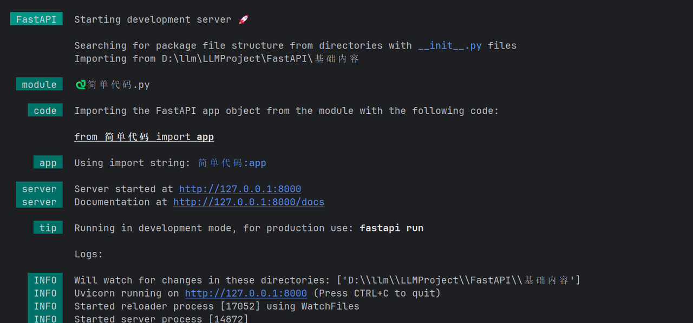
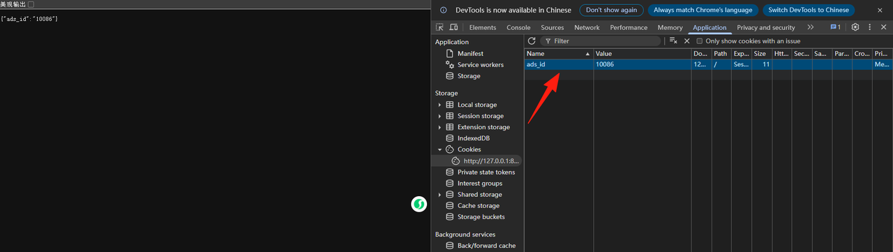
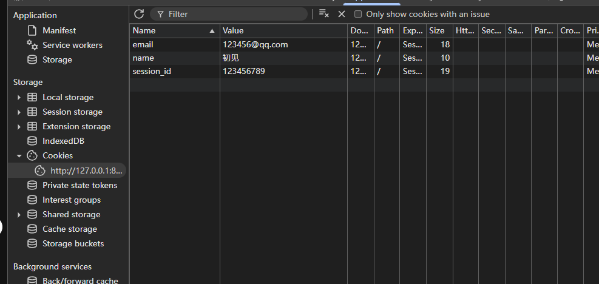
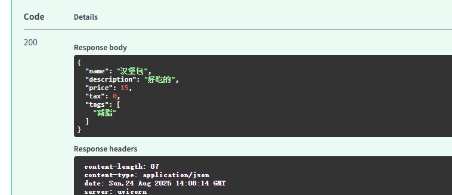
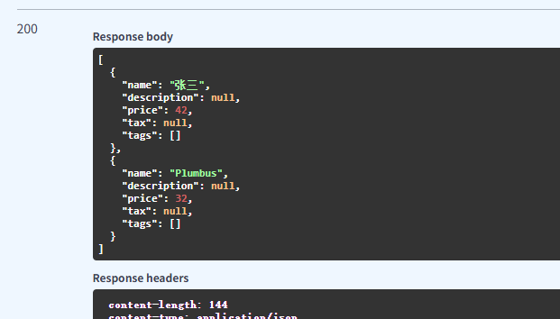

# FastAPI核心定义

**FastAPI** 是一个用于构建 API 的现代、高性能的 Python Web 框架。它专为快速开发而设计，并以其卓越的性能和开发者友好性而闻名。

简单来说，它就是一个工具包，让你能用 Python 非常快速、简单地创建出供其他程序（如前端网页、手机App、其他服务）调用的接口（API）。

## 它有什么厉害的功能？

1. 自动生成 API 文档
   写完代码，打开浏览器就能看到漂亮的交互式文档（支持 Swagger UI 和 ReDoc），不用自己手动写说明！



* 自动校验数据
  比如你要求用户传一个邮箱，FastAPI 会自动检查是不是合法的邮箱格式，不是就直接报错，不用你手写判断逻辑。

* 类型提示友好
  它充分利用了 Python 的“类型注解”（就是你在函数里写 `name: str` 这种），让代码更清晰、更安全，还能被编辑器智能提示。

* 异步支持好
  支持 `async`/`await`，适合处理高并发请求（比如同时有成千上万人访问你的 API）。

## HTTP 和 API 基础概念

### 什么是 HTTP 请求？


**HTTP 请求的核心组成部分:**

1. 请求行

HTTP 方法：GET/POST/PUT/DELETE

* 请求头

  常见的请求头：

  * `Host`：服务器的域名（比如 `www.baidu.com`）；

  * `Content-Type`：请求体的数据格式（比如 `application/json` 表示 JSON 格式，`form-data` 表示表单）；

  * `User-Agent`：客户端的身份（比如 “Chrome 浏览器”“Postman 测试工具”）；

  * `Authorization`：身份验证信息（比如登录后的 token）。

* 请求体

只有 POST/PUT 等需要 “传递数据” 的请求才有。（比如注册用户的时候，传递的用户名和密码）

### 什么是 URL 路径？

**URL路径**就是我们常说的 “网址”，而**URL 路径**是 URL 中用来定位 “服务器上具体资源” 的部分，相当于 “服务器里的文件 / 功能地址”。

`https://www.taobao.com/market/phone/iphone`

| 协议     | https://（通信规则（http/https））           |
| ------ | ------------------------------------ |
| 域名     | www.taobao.com（服务器的 “地址门牌号”）         |
| URL 路径 | /market/phone/iphone（核心！定位服务器上的具体资源） |
| 查询参数   | `?price=5000&color=red`（对资源的 “筛选条件”） |
| 锚点     | #detail（页面内的定位（前端用））                 |

### 什么是 请求参数？

请求参数就是**客户端在发送 HTTP 请求时，传递给服务器的 “额外数据 / 条件”**。

1.查询参数

在URL 中`?`后面的部分，多个参数用`&`分隔；

特点：可以在路径显式可见，适合传递非敏感的筛选/分页条件；

`http://localhost:8000/user?age=18&city=beijing&page=1`

2.路径参数

在URL 路径中，用{}标识；

特点：属于url路径的一部分，适合传递资源id等内容；

`http://localhost:8000/user/123`

3.请求体参数

HTTP 请求的 “请求体” 中（不是 URL 里），通常是 JSON 格式；

隐藏在请求里，适合传递大量 / 敏感数据（如注册、提交表单）；

POST/PUT 请求（GET 请求无请求体）。

```plain&#x20;text
{"username": "test123", "password": "123456", "age": 20}
```

4.表单参数（Form Data）

请求体中，格式为表单（`application/x-www-form-urlencoded`）；

适合前端表单提交（如登录页面）；

## Pydantic 模块

Pydantic 是一个用于执行数据验证的 Python 库。

* 基于**类型注解**定义数据模型，自动校验输入 / 输出数据的类型和格式；

* 自动将数据转换为指定类型（比如把字符串数字转成整数）；

* 清晰提示数据校验失败的原因（比如参数类型错误、缺少必填字段）。

3.10+的版本：

```python
from datetime import datetime

from pydantic import BaseModel


class User(BaseModel):
    id: int
    name: str = "John Doe"
    signup_ts: datetime | None = None
    friends: list[int] = []


external_data = {
    "id": "123",
    "signup_ts": "2017-06-01 12:22",
    "friends": [1, "2", b"3"],
}
user = User(**external_data)
print(user)
# > User id=123 name='John Doe' signup_ts=datetime.datetime(2017, 6, 1, 12, 22) friends=[1, 2, 3]
print(user.id)
# > 123
```

**注意：FastAPI 原生深度集成 Pydantic。**

### 带有元数据注释的类型提示

Python 还具有一项功能，允许使用`Annotated`在这些类型提示中放置**额外的元数据**。

```python
# 3.9+
from typing import Annotated

def say_hello(name: Annotated[str, "this is just metadata"]) -> str:    
    return f"Hello {name}"
```

要记住的重要一点是，传递给`Annotated`的**第一个*类型参数***&#x662F;**实际类型**。其余的只是其他工具的元数据。

## 并发和 async/await

### 并发

并发就是 “看起来同时” 处理多个任务&#x20;

核心：并发的本质是 **“任务切换”**，把等待的时间利用起来处理其他任务，提升整体效率。

Python 的现代版本支持通过一种&#x53EB;**"协程"**——使用 `async` 和 `await` 语法的东西来写实现**并发**

### 异步

异步就是 **“不等结果，先做别的”**，核心是：发起一个任务后，不原地等待它完成，而是继续执行其他任务，等这个任务有结果了再回来处理。


```python
# 同步代码
import time

# 模拟制作咖啡（同步：按下按钮后，店员傻等咖啡做好）
def make_coffee_sync(name, time_cost):
    print(f"店员：开始做{name}（需要{time_cost}秒）")
    # 同步等待：这期间店员啥也干不了，只能等
    time.sleep(time_cost)
    print(f"店员：{name}做好了！")

# 同步接单流程
def coffee_shop_sync():
    start_time = time.time()
    # 接一个单，等做好，再接下一个（串行）
    make_coffee_sync("美式咖啡", 3)
    make_coffee_sync("拿铁咖啡", 2)
    make_coffee_sync("卡布奇诺", 1)
    total_time = time.time() - start_time
    print(f"\n同步模式总耗时：{total_time:.1f}秒")

# 运行同步版本
if __name__ == "__main__":
    print("===== 同步接单模式 =====")
    coffee_shop_sync()

```

```python
# 异步代码
import asyncio
import time

# 模拟制作咖啡（异步：按下按钮后，店员去接下一个单，咖啡机自己做）
async def make_coffee_async(name, time_cost):
    print(f"店员：开始做{name}（需要{time_cost}秒）")
    # 异步等待：这期间店员可以去接其他单，不阻塞，关键是await 
    # await 只能在 async def 定义的函数内部使用。
    await asyncio.sleep(time_cost)
    print(f"店员：{name}做好了！")

# 异步接单流程
async def coffee_shop_async():
    start_time = time.time()
    # 同时接3个单，咖啡机并行制作（并发）
    # 把多个异步任务（协程）收集到一起，让它们并发执行，然后等待所有任务都完成，再汇总结果
    await asyncio.gather(
        make_coffee_async("美式咖啡", 3),
        make_coffee_async("拿铁咖啡", 2),
        make_coffee_async("卡布奇诺", 1)
    )
    total_time = time.time() - start_time
    print(f"\n异步模式总耗时：{total_time:.1f}秒")

# 运行异步版本
if __name__ == "__main__":
    print("===== 异步接单模式 =====")
    # 异步代码必须使用asyncio.run()去启动
    asyncio.run(coffee_shop_async())
```

# 基础内容

接下来我们写一个最基础的FsatAPI

```python
pip install "fastapi[standard]"
pip install uvicorn 
```

```python
from fastapi import FastAPI
import uvicorn

app = FastAPI()


@app.get("/")
async def root():
    return {"message": "Hello World"}
    
if __name__ == '__main__':
    uvicorn.run(app, host="127.0.0.1", port=8000)
```

```python
使用 fastapi dev 文件名.py 来启动服务
```



```python
# 使用  http://127.0.0.1:8000 来调用对应的接口
# 使用  http://127.0.0.1:8000/docs 来调用swagger文档
```

> 注意：如果碰到无法使用ctrl+c关闭进程，请使用以下命令关闭
>
> Get-Process -Name python    查询对应python进程
>
> Stop-Process -Id 53364 -Force  根据id进行kill
>
>
>
> 或者使用以下代码进行kill

```python
import psutil
import os
import signal
import platform


def list_python_processes():
    """列出所有 Python 进程"""
    python_procs = []
    for proc in psutil.process_iter(['pid', 'name', 'cmdline']):
        try:
            if 'python' in proc.info['name'].lower():
                python_procs.append(proc)
        except (psutil.NoSuchProcess, psutil.AccessDenied):
            continue
    return python_procs


def kill_process_by_pid(pid):
    """根据 PID 杀掉进程"""
    try:
        proc = psutil.Process(pid)
        print(f"Killing PID={pid}, Name={proc.name()}, Cmdline={' '.join(proc.cmdline())}")

        if platform.system() == "Windows":
            proc.kill()
        else:
            os.kill(pid, signal.SIGKILL)

        print(f"PID={pid} killed 成功.")
    except psutil.NoSuchProcess:
        print(f"PID={pid} does not exist.")
    except psutil.AccessDenied:
        print(f"没有杀死PID的权限={pid}. 尝试以admin/root身份运行.")
    except Exception as e:
        print(f"杀死PID失败={pid}: {e}")


if __name__ == "__main__":
    # 1. 列出 Python 进程
    procs = list_python_processes()
    if not procs:
        print("没有找到Python进程.")
    else:
        print("Python 进程:")
        for p in procs:
            print(f"PID={p.pid}, Name={p.name()}, Cmdline={' '.join(p.cmdline())}")

        # 2. 用户输入 PID
        try:
            # 建议从后面往前kill
            for _ in range(1000):
                pid = input("Enter PID to kill: ")
                kill_process_by_pid(int(pid))
        except ValueError:
            print("无效的PID。请输入数字PID")
```

## 路径参数

FastAPI 支持使用 Python 字符串格式化语法声明**路径参数**（**变量**）

```python
@app.get("/items/{item_id}")
async def get_item(item_id): 
    print(item_id)
    return {"message": "Hello World"}
    
# 这段代码把路径参数 item_id 的值传递给路径函数的参数 item_id。

 # item_id: int  使用pydantic语法声明类型为int，如果还是传的字符会直接提示
 # {"detail":[{"type":"int_parsing","loc":["path","item_id"],"msg":"Input should be a valid integer, unable to parse string as an integer","input":"fo"}]}
 
```

### 顺序很重要

有时，*路径操作*中的路径是写死的。

比如要使用 `/users/me` 获取当前用户的数据。

然后还要使用 `/users/{user_id}`，通过用户 ID 获取指定用户的数据。

由于*路径操作*是按顺序依次运行的，因此，一定要在 `/users/{user_id}` 之前声明 `/users/me`&#x20;

否则，`/users/{user_id}` 将匹配 `/users/me`，FastAPI 会**认为**正在接收值为 `"me"` 的 `user_id` 参数。

### 预设值

路径操作使用 Python 的 `Enum` 类型接收预设的*路径参数*。

```python
from enum import Enum

from fastapi import FastAPI


class ModelName(str, Enum):
    English = "英语"
    Chinese= "中文"
    French = "法语"


app = FastAPI()


@app.get("/models/{model_name}")
async def get_model(model_name: ModelName):
    if model_name is ModelName.English:
        return {"model_name": model_name, "message": "这是英文"}

    if model_name.value == "中文":
        return {"model_name": model_name, "message": "这是中文"}

    return {"model_name": model_name, "message": "这是法语"}
```

### 路径参数和数值校验

可以使用PATH为路径参数声明相同类型的校验和元数据

```python
from typing import Annotated

from fastapi import FastAPI, Path, Query

app = FastAPI()


# Annotated给类型加上额外的元数据
@app.get("/items/{item_id}")
async def read_items_mate_data(
        item_id: Annotated[int, Path(title="要获取的项目的ID", le=10)],
):
    results = {"item_id": item_id}
    return results
```

## 查询参数

声明的参数不是路径参数时，路径操作函数会把该参数自动解释为**查询**参数。

```python
from fastapi import FastAPI

app = FastAPI()

fake_items_db = [{"item_name": "苹果"},{"item_name": "香蕉"},{"item_name": "橙子"},{"item_name": "笔记本电脑"},{"item_name": "无线鼠标"},{"item_name": "蓝牙耳机"},{"item_name": "纯棉T恤"},{"item_name": "休闲裤"},{"item_name": "保温杯"},{"item_name": "充电宝"}]


@app.get("/items/")  # 因为参数有默认值
async def read_item(skip: int = 0, limit: int = 10): # 查询0-10条数据
    return fake_items_db[skip : skip + limit]
```

访问：http://127.0.0.1:8000/items/?skip=0\&limit=10就能获取对应的数据

**多个路径和查询参数**

定义了一个 **带两个路径参数的路由**

**优势**

* **更语义化**：路径就像目录层级一样，描述清楚资源归属

  * `/users/123/items/456` → 用户 123 的物品 456

* **自动验证类型**：FastAPI 会根据函数参数的类型自动转换和校验

  * `user_id: int` → 如果传的不是整数，会直接报 422 错误

```python
from fastapi import FastAPI
    
app = FastAPI()


@app.get("/users/{user_id}/items/{item_id}")
async def read_user_item(
    user_id: int, item_id: str, q: str | None = None, short: bool = False
):
    item = {"item_id": item_id, "owner_id": user_id}
    if q:
        item.update({"q": q})
    if not short:
        item.update(
            {"description": "这是多路径查询"}
        )
    return item
```


**<span style="color: rgb(216,57,49); background-color: inherit">注意：如果要把查询参数设置为必选，就不要声明默认值</span>**

### 查询参数和字符串校验

```python
from fastapi import FastAPI

app = FastAPI()

# 查询参数 q 的类型为 str，默认值为 None，因此它是可选的。
@app.get("/items/")
async def read_items(q: str | None = None):
    results = {"items": [{"item_id": "Foo"}, {"item_id": "Bar"}]}
    if q:
        results.update({"q": q})
    return results
```

即使 `q` 是可选的，但只要提供了该参数，则该参数值**不能超过50个字符的长度**。

```python
# Query是在参数q提供的时候做出限制最大长度为50
@app.get("/read/items/")
async def read_items(q: Annotated[str | None, Query(max_length=50)] = None):
    results = {"items": [{"item_id": "Foo"}, {"item_id": "Bar"}]}
    if q:
        results.update({"q": q})
    return results
```

**`min_length`**：最小长度（字符长度）
**`max_length`**：最大长度（字符长度）

**`pattern`**：正则表达式 （在线正则网站：https://www.sojson.com/regex/generate，建议可以让大模型生成）

**`default`**：默认值（当没有默认值的时候，参数就是必选参数）

**`description`：**&#x5B57;段描述

**`alias`:&#x20;**&#x53D6;别名

**`deprecated`**：设置true弃用参数

### 查询参数模型

* `gt`：大于（`g`reater `t`han）

* `ge`：大于等于（`g`reater than or `e`qual）

* `lt`：小于（`l`ess `t`han）

* `le`：小于等于（`l`ess than or `e`qual）

以上四个限制只能对应数值判断

```python
from typing import Annotated, Literal

from fastapi import FastAPI, Query
from pydantic import BaseModel, Field

app = FastAPI()

class FilterParams(BaseModel):
    """ Pydantic 模型的查询参数，用于通用分页和筛选 """

    # 每页返回的数据条数，默认 100，要求 >0 且 <=100
    limit: int = Field(100, gt=0, le=100)

    # 数据偏移量（分页用），默认 0，要求 >=0
    offset: int = Field(0, ge=0)

    # 排序字段，只允许是 "created_at" 或 "updated_at"，默认 "created_at"
    order_by: Literal["created_at", "updated_at"] = "created_at"

    # 标签过滤，默认空列表，可以传多个标签
    tags: list[str] = []


@app.get("/items/query")
async def query_items(filter_query: Annotated[FilterParams, Query()]):
    return filter_query
```

## 请求体

FastAPI 使用**请求体**从客户端（例如浏览器）向 API 发送数据。

**请求体**是客户端发送给 API 的数据。**响应体**是 API 发送给客户端的数据。

API 基本上肯定要发送**响应体**，但是客户端不一定发送**请求体**。

使用 **Pydantic&#x20;**&#x6A21;型声明**请求体**，能充分利用它的功能和优点。

1.从`pydantic` 中导入 `BaseModel`：

```python
from fastapi import FastAPI
from pydantic import BaseModel


class Item(BaseModel):
    """
    创建数据模型,把数据模型声明为继承 BaseModel 的类。
    和查询参数一样，如果没有默认值就是必填属性
    """
    name: str
    description: str | None = None
    price: float
    tax: float | None = None

app = FastAPI()


@app.post("/items/")
async def create_item(item: Item):  # 使用与声明路径和查询参数相同的方式声明请求体，把请求体添加至路径操作
    item_dict = item.model_dump()  # 将对象字段转变成字典
    if item.tax is not None:
        price_with_tax = item.price + item.tax
        item_dict.update({"price_with_tax": price_with_tax})
    return item_dict
```

> tips：
>
> 大家可以去PyCharm插件中安装pydantic，来获得更好的代码补全和类型检查等功能。

### 请求体-字段

与在*路径操作函数*中使用 `Query`、`Path`  声明校验与元数据的方式一样，可以使用 Pydantic 的 `Field` 在 Pydantic 模型内部声明校验和元数据。

**导入 `Field`**

从 Pydantic 中导入 `Field`

```python
from typing import Annotated

from fastapi import Body, FastAPI
from pydantic import BaseModel, Field
import uvicorn

app = FastAPI()


class Item(BaseModel):
    name: str = Field(description="项目名称")
    description: str | None = Field(
        default=None, title="项目的描述", max_length=300
    )
    price: float = Field(gt=0, description="价格必须大于零")
    tax: float | None = Field(default=None, description="税收")


# Body(description="项目字段") 只建议添加描述；只要在对应的实体Model中配置Field去添加校验，描述等
@app.put("/items/{item_id}")
async def update_item(item_id: int, item: Annotated[Item, Body(description="项目字段")]):
    results = {"item_id": item_id, "item": item}
    return results


if __name__ == '__main__':
    uvicorn.run(app, host="127.0.0.1", port=8000)
```

```json
# Body(embed=True) 表示在原有的json格式中加item
{
  "item": {
    "name": "string",
    "description": "string",
    "price": 1,
    "tax": 0
  }
}    
# 原有格式
{
    "name": "string",
    "description": "string",
    "price": 1,
    "tax": 0
}
```

### 请求体 - 嵌套模型

#### List 字段

你可以将一个属性定义为拥有子元素的类型。例如 Python `list`

```python
from fastapi import FastAPI
from pydantic import BaseModel

app = FastAPI()


class Item(BaseModel):
    name: str
    description: str | None = None
    price: float
    tax: float | None = None
    tags: list = []


@app.put("/items/{item_id}")
async def update_item(item_id: int, item: Item):
    results = {"item_id": item_id, "item": item}
    return results
```

#### 具有子类型的 List 字段

```python
from typing import List, Union

from fastapi import FastAPI
from pydantic import BaseModel

app = FastAPI()


class Item(BaseModel):
    name: str
    description: Union[str, None] = None
    price: float
    tax: Union[float, None] = None
    tags: List[str] = []


@app.put("/items/{item_id}")
async def update_item(item_id: int, item: Item):
    results = {"item_id": item_id, "item": item}
    return results
```

#### 嵌套模型

```python
from fastapi import FastAPI
from pydantic import BaseModel

app = FastAPI()


class Image(BaseModel):
    url: str
    name: str


class Item(BaseModel):
    name: str
    description: str | None = None
    price: float
    tax: float | None = None
    tags: set[str] = set()
    image: Image | None = None


@app.put("/items/{item_id}")
async def update_item(item_id: int, item: Item):
    results = {"item_id": item_id, "item": item}
    return results
```

数据类似这种：

```json
{
    "name": "Foo",
    "description": "The pretender",
    "price": 42.0,
    "tax": 3.2,
    "tags": ["rock", "metal", "bar"],
    "image": {
        "url": "http://example.com/baz.jpg",
        "name": "The Foo live"
    }
}
```

## Cookie参数

### 什么是Cookie？

**Cookie** 是 **存储在浏览器中的一小段文本数据**，由服务器生成并发送给客户端（浏览器）。
&#x20;浏览器会在 **后续请求**中自动携带这些 Cookie 发回服务器，从而实现 **状态保持**。

> 由于 **HTTP 是无状态协议**，服务器无法记住用户是谁，而 Cookie 解决了这个问题。

### &#x20;Cookie 的作用

1. **身份验证**（记录登录状态，用户免密访问）

2. **个性化设置**（记住用户的语言、主题等偏好）

3. **会话跟踪**（购物车、用户行为跟踪）

导入 `Cookie`

```python
from typing import Annotated
from fastapi import Cookie, FastAPI

app = FastAPI()

@app.get("/cookies1/")
async def get_cookie(id: Annotated[str | None, Cookie()] = None):
    return {"id": id}
```



http://127.0.0.1:8000/cookies1/

### 带有 Pydantic 模型的 Cookie

```python
from typing import Annotated

from fastapi import Cookie, FastAPI
from pydantic import BaseModel

app = FastAPI()


class Cookies(BaseModel):
    session_id: str
    name: str | None = None
    email: str | None = None


@app.get("/cookies2/")
async def get_cookie1(cookies: Annotated[Cookies, Cookie()]):
    print(cookies)
    fixed_str = cookies.name.encode('latin1').decode('utf-8')
    print(fixed_str)
    return cookies
```



### 禁用额外的 Cookie

```python
# 除了在类中定义的属性，其他属性不能支持，请看下面图片
class Cookies1(BaseModel):
    model_config = {"extra": "forbid"}
    session_id: str
    name: str | None = None
    email: str | None = None

@app.get("/cookies3/")
async def read_items(cookies: Annotated[Cookies1, Cookie()]):
    return cookies
```


## 响应模式

限制返回的内容

```python
from typing import Any

from fastapi import FastAPI
from pydantic import BaseModel

app = FastAPI()


class Item(BaseModel):
    name: str
    description: str | None = None
    price: float
    tax: float | None = None
    tags: list[str] = []


@app.post("/createItem", response_model=Item)
async def create_item(item: Item) -> Any: # 可以返回任意类型，但是会转换成Item，如果格式不对会报错，最好是把返回值改成Item
    return item


@app.get("/readItems/", response_model=list[Item])
async def read_items() -> Any:
    return [
        {"name": "张三", "price": 42.0},
        {"name": "Plumbus", "price": 32.0},
    ]
```





> 千万不要存储用户的明文密码。始终存储可以进行验证的**安全哈希值**。

```python
from fastapi import FastAPI
from pydantic import BaseModel, EmailStr

app = FastAPI()

# 用户输入属性
class UserIn(BaseModel):
    username: str
    password: str
    email: EmailStr
    full_name: str | None = None

# 返回属性
class UserOut(BaseModel):
    username: str
    email: EmailStr
    full_name: str | None = None

# 数据库属性
class UserInDB(BaseModel):
    username: str
    hashed_password: str
    email: EmailStr
    full_name: str | None = None

# 将密码进行加密
def fake_password_hasher(raw_password: str):
    return "supersecret" + raw_password

# 将用户信息存储
def fake_save_user(user_in: UserIn):
    hashed_password = fake_password_hasher(user_in.password)
    """
        **user_in.dict():Pydantic 模型支持 .dict() 方法，能返回包含模型数据的字典，
        把字典 user_dict 以 **user_dict 形式传递给函数（或类），Python 会执行解包操作。它会把 user_dict 的键和值作为关键字参数直接传递。
    """
    user_in_db = UserInDB(**user_in.dict(), hashed_password=hashed_password)
    print("用户已保存！")
    return user_in_db


@app.post("/user/", response_model=UserOut)
async def create_user(user_in: UserIn):
    user_saved = fake_save_user(user_in)
    return user_saved
```

**减少重复代码**

**FastAPI** 的核心思想就是减少代码重复。

声明 `UserBase` 模型作为其它模型的基类。然后，用该类衍生出继承其属性（类型声明、验证等）的子类。

```python
from fastapi import FastAPI
from pydantic import BaseModel, EmailStr

app = FastAPI()


class UserBase(BaseModel):
    username: str
    email: EmailStr
    full_name: str | None = None


class UserIn(UserBase):
    password: str


class UserOut(UserBase):
    pass


class UserInDB(UserBase):
    hashed_password: str


def fake_password_hasher(raw_password: str):
    return "supersecret" + raw_password

# 将用户信息存储
def fake_save_user(user_in: UserIn):
    hashed_password = fake_password_hasher(user_in.password)
    """
        **user_in.dict():Pydantic 模型支持 .dict() 方法，能返回包含模型数据的字典，
        把字典 user_dict 以 **user_dict 形式传递给函数（或类），Python 会执行解包操作。它会把 user_dict 的键和值作为关键字参数直接传递。
    """
    user_in_db = UserInDB(**user_in.dict(), hashed_password=hashed_password)
    print("用户已保存！")
    return user_in_db


@app.post("/user/", response_model=UserOut)
async def create_user(user_in: UserIn):
    user_saved = fake_save_user(user_in)
    return user_saved
```

## HTTP 状态码

* `100` 及以上的状态码用于返回**信息**。这类状态码很少直接使用。具有这些状态码的响应不能包含响应体

* **`200`** 及以上的状态码用于表示**成功**。这些状态码是最常用的

  * `200` 是默认状态代码，表示一切**正常**

  * `201` 表示**已创建**，通常在数据库中创建新记录后使用

  * `204` 是一种特殊的例子，表示**无内容**。该响应在没有为客户端返回内容时使用，因此，该响应不能包含响应体

* **`300`** 及以上的状态码用于**重定向**。具有这些状态码的响应不一定包含响应体，但 `304`**未修改**是个例外，该响应不得包含响应体

* **`400`** 及以上的状态码用于表示**客户端错误**。这些可能是第二常用的类型

  * `404`，用于**未找到**响应

  * 对于来自客户端的一般错误，可以只使用 `400`

* `500` 及以上的状态码用于表示服务器端错误。几乎永远不会直接使用这些状态码。应用代码或服务器出现问题时，会自动返回这些状态代码

## 文件上传

安装依赖

```python
pip install python-multipart # 用于解析 multipart/form-data 请求体，支持文件上传
```

### 基础概念

&#x20;**什么是表单数据？**

在网页中进行注册、登录、头像、文档等

**两种处理方式：**

* `bytes`：全部读入内存，适用小文件（如小图标）

* `UploadFile`：智能内存管理，适用大文件（如视频、文档）

### 上传单个文件

1\. 使用 `bytes` 类型

```python
from fastapi import FastAPI, File

app = FastAPI()

@app.post("/uploadfile/")
async def create_upload_file(file: bytes = File(description="以字节形式读取的文件")):
    return {"file_size": len(file)}

```

> **工作原理：**
>
> 1. 用户选择文件
>
> 2. FastAPI把整个文件读入内存
>
> 3. 以字节形式传给你的函数

2.使用 `UploadFile` 类型

```python
from fastapi import FastAPI, UploadFile, File

app = FastAPI()

@app.post("/uploadfile/")
async def create_upload_file(file: UploadFile = File(description="作为UploadFile读取的文件")):
    return {"filename": file.filename, "content_type": file.content_type}

```

> **智能存储**：小文件放内存，大文件存磁盘
>
> **丰富信息**：文件名、类型、大小
>
> **高效处理**：不会占满你的内存

### UploadFile 详解

`UploadFile` 的属性如下：

* `filename`：上传文件名字符串（`str`），例如， `myimage.jpg`；

* `content_type`：内容类型（MIME 类型 / 媒体类型）字符串（`str`），例如，`image/jpeg`；

* `file`： `SpooledTemporaryFile`（ [file-like](https://docs.python.org/zh-cn/3/glossary.html#term-file-like-object) 对象）。其实就是 Python文件，可直接传递给其他预期 `file-like` 对象的函数或支持库。

**什么是 `SpooledTemporaryFile`？**

特点：

* 文件小的时候，内容会先存储在 **内存**（buffer）里；

* 当文件变大超过一定阈值时，会自动写入到磁盘上的临时文件。

* 这样既能提高性能（小文件直接在内存中操作），也能保证大文件不会撑爆内存

```python
@app.post("/uploadfile/")
async def analyze_file(file: UploadFile):
    return {
        "filename": file.filename,        # 文件名，如 "photo.jpg"
        "content_type": file.content_type, # 文件类型，如 "image/jpeg"
        "size": file.size                  # 文件大小（如果可获取）
    }
```

### 可选文件上传

让文件上传变为可选

```python
@app.post("/optional-file/")
async def upload_optional_file(file: UploadFile | str = File(default=None)):
    print(file)
    if not file:
        return {"message": "没有上传文件"}
    else:
        return {"filename": file.filename}
```

### 多文件上传

```python
@app.post("/multiple-files/")
async def upload_multiple_files(files: list[UploadFile]):
    file_info = []
    for file in files:
        file_info.append({
            "filename": file.filename,
            "size": len(await file.read())
        })
        # 记得重置文件指针
        await file.seek(0)
    
    return {"files": file_info}
```

# 基于fastapi+VUE的智能聊天系统

详情请看后面网盘中的内容

[fastapi项目案例.zip](files/FastAPI-fastapi项目案例.zip)


